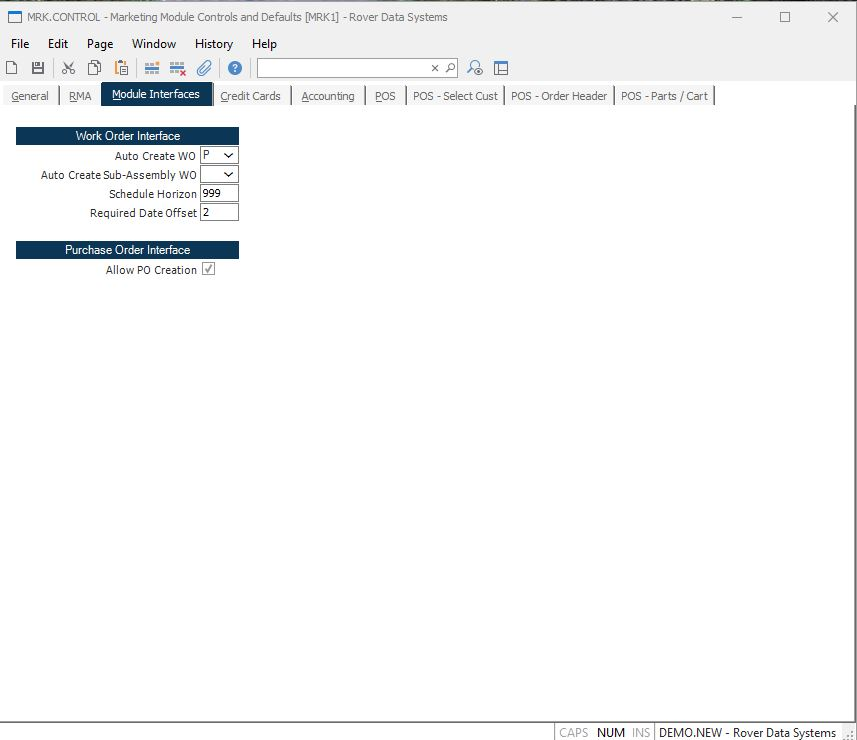

##  Marketing Module Controls and Defaults (MRK.CONTROL)

<PageHeader />

##  Module Interfaces

**Auto Create WO** If you wish to have a work order (or work orders)
automatically created when the sales order is filed, enter a 'Y'. If you wish
to only create work orders when the Parts flag is set, enter "P". Leave this
field empty, or enter "N" to skip the creation of work orders.  
  
**Auto Create Sub-Assembly WO** If you wish to have work orders created from the sales order entry procedure, [ SO.E ](../../SO-E/README.md) , for the sub-assemblies used on the assembly that a sales order is placed for enter "Y" or "P" in this field. If you enter a "Y" work orders will be created for all sub-assemblies. If you enter a "P", work orders will only be created if the CREATE WO? box is checked in [ PARTS.E ](../../../../ENG-OVERVIEW/ENG-ENTRY/PARTS-E/README.md) . Work orders will only be created for items with a type code of "A". If you do not wish to create work orders for sub-assemblies, leave this field blank or enter a "N". Please note that the system will not create sub-assembly work orders unless a work order is being generated for the part referenced on the sales order. Therefore, if the AUTO CREATE WO? field is not set to "P" or "Y", no work orders will be generated for that item.   
  
**Schedule Horizon** This field determines for which schedule dates a work order will be created. For any one line item on the sales order, all schedule dates falling within the specified horizon (current system date plus the number of days entered here) will have work order created. The number of days is work days as defined on the [ MC.CONTROL ](../../../../MFG-OVERVIEW/MFG-ENTRY/MC-CONTROL/README.md) calendar.   
  
**Required Date Offset** If you are creating work order from sales orders, the number of days entered here will be subtracted from the scheduled ship date and used as the required date on the work order. This will allow work orders to be scheduled for completion before the scheduled ship date. The number of days is work days as defined on the [ MC.CONTROL ](../../../../MFG-OVERVIEW/MFG-ENTRY/MC-CONTROL/README.md) calendar.   
  
**Allow PO Creation** If you wish to allow the user to generate Purchase Orders directly from the Sales Order entry procedure, check this box. Leaving the box unchecked will cause the [ SO.E ](../../SO-E/README.md) procedure to skip the related fields.   
  
  
<badge text= "Version 8.10.57" vertical="middle" />

<PageFooter />