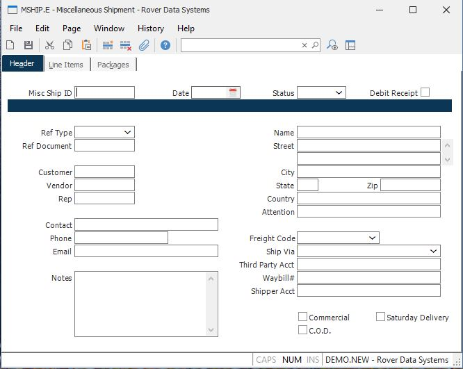

##  Miscellaneous Shipment (MSHIP.E)

<PageHeader />

##  Header

**MSHIP.ID** The miscellaneous ship ID. This can be entered by the user, or
for new records defaulted to the next sequential number when the record is
filed.  
  
**Date** The date of this shipment. This will default to the current date for
new records.  
  
**Status** The status of the record - "N" for New , "S" for Shipped, or "C"
for cancelled. When the status is changed to Shipped, if there are any line
items with from and to locations, an inventory transaction will be done for
those items. The status of "C" will be set automatically when a debit receipt
has been reversed.  
  
**Ref Type** Enter the reference type associated with the reference document.
This will determine which file the document is associated with for retrieving
the document and defaulting data.  
  
**Ref Doc** Enter the document number for the corresponding reference type if
you want data to be loaded from a sales order, purchase order, etc. The
reference type must be entered first.  
  
**Cust Id** Enter the customer number for this shipment if applicable. Address
data will be retrieved for the corresponding customer.  
  
**Vendor** Enter the vendor number for this shipment if applicable. Address
data will be retrieved for the corresponding vendor.  
  
**Rep** Enter the rep number for this shipment if applicable. Address data
will be retrieved for the corresponding rep.  
  
**Contact** Enter the contact name for this shipment.  
  
**Phone** Enter the contact phone number for this shipment.  
  
**Email** Enter the contact email for this shipment.  
  
**Notes** Enter any notes applicable to this document.  
  
**Ship Name** Enter the ship-to name.  
  
**Ship Address** Enter the ship-to street address.  
  
**Ship City** Enter the ship-to city.  
  
**Ship State** Enter the ship-to state code.  
  
**Ship Zip** Enter the ship-to zip code.  
  
**Ship Country** Enter the country to which the items will be shipped. Please note that you may be required to enter the country name as it has been entered in the [ SHIP.CONTROL ](SHIP-CONTROL/README.md) procedure. For example, instead of entering U.S.A. you may need to enter United States. If this requirement has been applied to your account, an error message will be displayed if the entry made into this field does not match the entry found in [ ship.control ](ship-control/README.md) .   
  
**Ship Attn** Enter the ship-to attention line.  
  
**Freight Code** Enter the letter "P" if the freight charges for this shipment
are to be prepaid. Enter the letter "C" if the frieght charges are to
collected from the recipient by the freight carrier. Enter the letter "T" if
the freight charges are to be paid by a third party. Enter the letter "F" if
no charges are to be billed to the customer.  
  
**Ship Via** Enter the method of shipment or carrier to be used when shipping the items on this shipment. If ship methods have been defined in the [ SHIP.CONTROL ](SHIP-CONTROL/README.md) procedure, this entry will be validated.   
  
**Third Party Account Number** If a thirdy party will be paying for the
freight charges, enter their account number here. When the record is created
the program will attempt to load this number in for you based on the ship via
method. This number will only be used if the freight code is set to "T" for
third party.  
  
**Waybill** Enter the number of the waybill which will accompany the shipment.  
  
**Shipper Account** If required, enter the shipper's / company's account
number in this field.  
  
**Ship Comm** Check this box if the shipment will be sent to a commercial
address.  
  
**Cod** Check this box if the shipment is to be sent C.O.D. (cash on
delivery).  
  
**Saturday Delivery** Check this box if the order will be delivered on a
Saturday.  
  
**Auto Created** This is checked if the record was created automatically through the debit receipt process ( [ RECEIPTS.E2 ](../../../../../../../rover/AP-OVERVIEW/AP-ENTRY/AP-E/AP-E-1/MSHIP-E/RECEIPTS-E2) ). It is for information only and cannot be changed. If checked, then the line item data cannot be changed in MSHIP.E. It is controlled through the [ RECEIPTS.E2 ](../../../../../../../rover/AP-OVERVIEW/AP-ENTRY/AP-E/AP-E-1/MSHIP-E/RECEIPTS-E2) entry. Upon changing the status to "S" this record will process the debit receipt.   
  
  
<badge text= "Version 8.10.57" vertical="middle" />

<PageFooter />