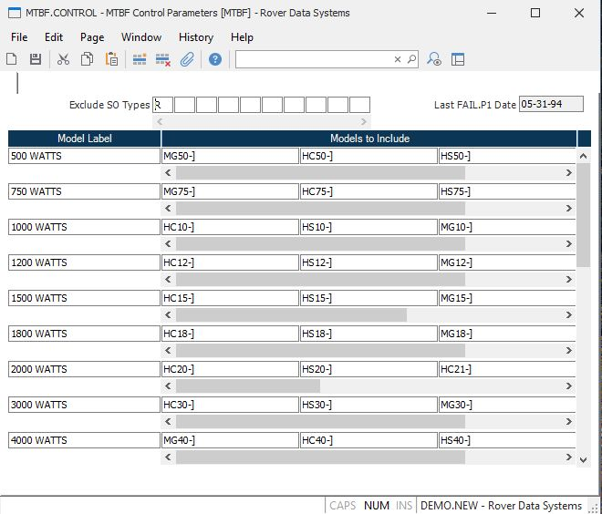

##  MTBF Control Parameters (MTBF.CONTROL)

<PageHeader />

##

**Control ID** The record ID to the MTBF control record is "MTBF" and is
automatically loaded by the system.  
  
**Exclude SO Types** The data in this field is used to exclude certain
shipments from the MTBF calculation process. Enter all of the Sales Order type
codes which should not be included in the MTBF calculation. For example, you
would not want to include the shipments for returned items which you have
repaired since this would incorrectly inflate the number of those units shown
in operation. If the type code for RMA re-shipments is "R" you would enter the
letter "R" in this field.  
  
**Model Numbers** Enter the label you wish to use to define the model or group
of models to be used in the calculation of MTBF. This label will appear on the
MTBF reports.  
  
**Associated Models** Enter the identification of each model to be included
within the associated label for the MTBF  
calculation. You may choose to enter complete model numbers or wildcard
patterns to define  
the items for inclusion. Wildcards allow you to enter pieces of a model number
so that you can  
get an entire group of model numbers by specifying one entry. For example,
suppose you had  
three model numbers, HC1010-C1150, HC1012-C1280, HC1015-C1500 and you wanted
to  
include all of these into one group, you could enter each one individually or
just enter  
HC10-C]. This tells the system that all items beginning with HC10, followed by
any 2 characters, followed by -C and any other set of characters would be
included.  
  
**Last FAIL.P1 Date** Contains the last date through which the [ FAIL.P1 ](../../../MRK-PROCESS/FAIL-P1/README.md) process to collect MTBF data has been run. This data is posted by the [ FAIL.P1 ](../../../MRK-PROCESS/FAIL-P1/README.md) procedure and may not be updated.   
  
  
<badge text= "Version 8.10.57" vertical="middle" />

<PageFooter />