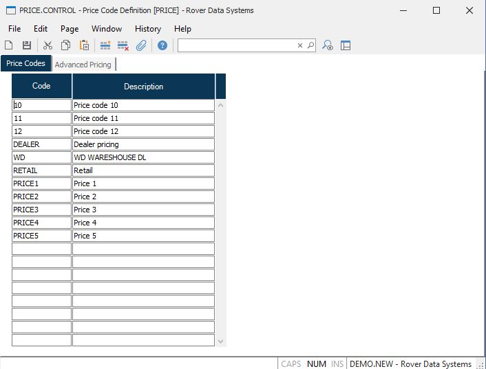

##  Price Code Definition (PRICE.CONTROL)

<PageHeader />

##

**Control ID** The ID "PRICE" is automatically entered and is the only vaild
ID for this procedure.  
  
**Code** Enter each of the price codes that are to be available in the system. Price code entry fields in procedures such as [ CUST.E ](../../../../AR-OVERVIEW/AR-ENTRY/CUST-E/README.md) and [ SO.E ](../../SO-E/README.md) will validate the entries against this list.   
  
**Description** Enter the description of the coresponding price code.  
  
  
<badge text= "Version 8.10.57" vertical="middle" />

<PageFooter />