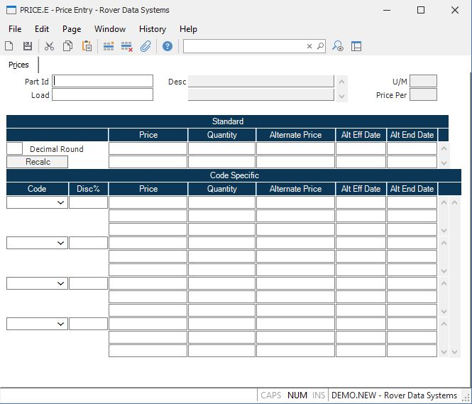

##  Price Entry (PRICE.E)

<PageHeader />

##  Prices

**Part Number** The record IDs to the PRICE file are part numbers. Enter the
part number associated to the pricing structure you want to enter or change.  
  
**Load** The field can be used to load the pricing information from another
part number onto this screen.  
  
**Desc** Contains the description of the part number entered. The description
is displayed for information only and may not be changed.  
  
**U/M** Contains the unit of measure of the part number entered. It is
displayed for information only and may not be changed.  
  
**Standard Price** Enter the standard unit price. This is the price defaulted
into the sales order entry screen when the part number is entered and there
are no price altering conditions such as a sales order date which triggers the
alternate price to be used or code specific pricing to be used.  
  
This price is associated to the quantity immediately to the right. If there is
no quantity, then there is only one price. If you wish to define quantity
breaks, set the maximum quantity associated with this price. For example, if
the price of a part is $100 for any quantity from 1 to 9, then $95 for 10 and
above, place $100 in this price field and a quantity of 9 in the associated
quantity. Then, define the $95 price next and place an associated quantity of
10. There is no limit to the number of quantity breaks you may define. If a
quantity larger that your last defined quantity break is entered in order
entry, the last price will be used.  
  
**Qty** This field contains the quantity breaks associated with the standard
pricing. The associated price will be used when the quantity ordered is less
than or equal to the quantity entered in this field.  
  
**Alt Standard Price** The alternate standard price is used in place of the
standard price when the sales order date falls between the effective date and
end date. This can be used to denote special pricing (higher or lower) for a
specified period of time, or can be used as a way of changing to a new
standard price. The latter case is accomplished by entering the current price
in this field, and entering the new price in the regular price field. Then you
set the effective date to today's date and the end date to the last date on
which the current price is still valid. The system will then use the alternate
price until the day after the end date, at which time it will begin using the
new price in the standard price field.  
  
**Standard Eff Date** Enter the date on which the alternate price will take
affect.  
  
**Standard End Date** Enter the last date on which the alternate price will be
effective. Sales order dates after this date will default to the standard
price.  
  
**Code** Enter the code number for which the associated pricing information
applies. Each customer can be assigned a code which is associated with this
field. The code is loaded into the sales order and used for determining the
price.  
  
**Code Pct** If you wish to calculate the price(s) for this code, based upon a
discount from the standard price above, enter the discount percentage here.  
  
**Price** Enter the unit price associated with the code. This price will be
used when the sales order date does not fall within the date range for the
associated alternate price.  
  
This price is associated to the quantity immediately to the right. If there is
no quantity, then there is only one price. If you wish to define quantity
breaks, set the maximum quantity associated with this price. For example, if
the price of a part is $100 for any quantity from 1 to 9, then $95 for 10 and
above, place $100 in this price field and a quantity of 9 in the associated
quantity. Then, define the $95 price next and place an associated quantity of
10. There is no limit to the number of quantity breaks you may define. If a
quantity larger that your last defined quantity break is entered in order
entry, the last price will be used.  
  
**Qty** This field contains the quantity breaks associated with the code
pricing. Multiple quantities are permitted for each code entered. The
associated price will be used when the quantity ordered is less than or equal
to the quantity entered in this field.  
  
**Alt Vendor Price** The alternate code price is used in place of the code
price when the sales order date falls between the associated effective and end
date.  
  
**Alt Eff Date** Enter the date on which the alternate price will take affect.  
  
**Alt End Date** Enter the last date on which the alternate price will be
effective. Sales order dates after this date will default to the code price.  
  
**Price Per** Contains the price per factor for the unit of measure of the part number. It is displayed for information only and may not be changed. This factor is maintained in [ UM.CONTROL ](../../../../ENG-OVERVIEW/ENG-ENTRY/UM-CONTROL/README.md) and used in the sales order and shipping processes.   
  
**Recalc** Select this button if you wish to have the code prices recalculated
based upon the percentage off from standard.  
  
**Decimal Round** When calculating the prices based upon a discount percent
from standard, if you wish to round the resulting price to a certain decimal
accuracy, enter that number here.  
  
  
<badge text= "Version 8.10.57" vertical="middle" />

<PageFooter />