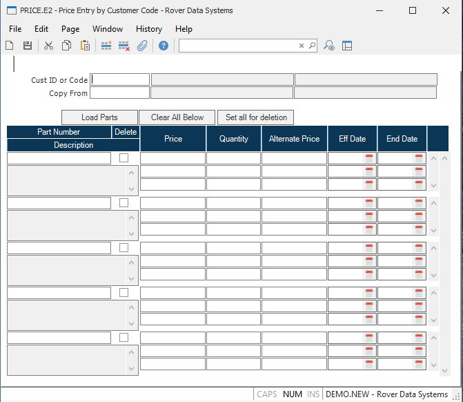

##  Price Entry by Customer Code (PRICE.E2)

<PageHeader />

##

**ID** The record ID in this procedure is not used.  
  
**Code** Enter either the customer number for which you are updating pricing,
or a customer pricing code.  
  
**Load** The field can be used to load the pricing information from another
customer number or pricing code onto this screen.  
  
**Name** Contains the name of the cutomer entered if a cutomer ID was
specified.. The name is displayed for information only and may not be changed.  
  
**Load Name** This field contains the name of the customer, if the entry in
the load field is a customer number.  
  
**Part Number** This field contains the part number for which pricing is being
established.  
  
**Part Description** This field contains the description of the part, as it
appears in the Parts file.  
  
**Delete?** If you with to remove this part from the price file, check this
box.  
  
**Price** Enter the unit price associated with the code. This price will be
used when the sales order date does not fall within the date range for the
associated alternate price.  
  
This price is associated to the quantity immediately to the right. If there is
no quantity, then there is only one price. If you wish to define quantity
breaks, set the maximum quantity associated with this price. For example, if
the price of a part is $100 for any quantity from 1 to 9, then $95 for 10 and
above, place $100 in this price field and a quantity of 9 in the associated
quantity. Then, define the $95 price next and place an associated quantity of
10. There is no limit to the number of quantity breaks you may define. If a
quantity larger that your last defined quantity break is entered in order
entry, the last price will be used.  
  
**Qty** This field contains the quantity breaks associated with the code
pricing. Multiple quantities are permitted for each code entered.  
  
**Alt Vendor Price** The alternate code price is used in place of the code
price when the sales order date falls between the associated effective and end
date.  
  
**Alt Eff Date** Enter the date on which the alternate price will take affect.  
  
**Alt End Date** Enter the last date on which the alternate price will be
effective. Sales order dates after this date will default to the code price.  
  
**Load Parts** This option is used to load all part numbers which currently
exist in the Parts file, even if they do not yet have a price in the Price
file. This option is most commonly used to make an initial load of prices.  
  
**Clear All Below** Use this button to clear all of the part information
below. This can be used when you wish to load only selected parts from either
the Price or Parts file.  
  
**Set all for deletion** Use this button to set the deletion flag on all parts
below.  
  
  
<badge text= "Version 8.10.57" vertical="middle" />

<PageFooter />