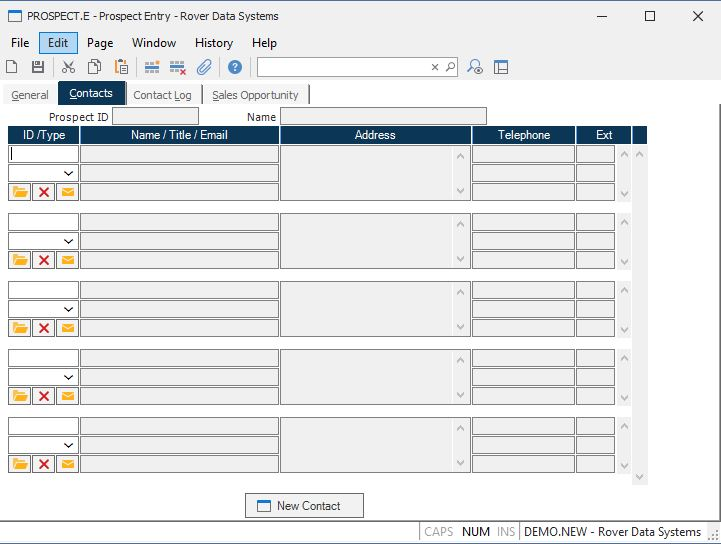

##  Prospect Entry (PROSPECT.E)

<PageHeader />

##  Contacts

**Prospect ID** This field contains the prospect ID from screen 1 and is for
reference only.  
  
**Name** This field contains the name of the prospect from screen 1 and is for
reference only.  
  
**Contact ID** Displays the IDs of all the contacts associated with the
prospect. To add an existing contact to the list you may enter the contact ID
or a word or portion of a word from the contact name to display a list of
possible entries to select from. If the contact is not already on file you may
create it by clicking the "New Contact" button.  
  
**Contact Type** Enter the type code to be associated with the contact. The list of options available is defined in the [ CONTACT.CONTROL ](../../../../../../rover/AP-OVERVIEW/AP-ENTRY/CONTACT-CONTROL) procedure.   
  
**Contact Name** Displays the name of each contact.  
  
**Contact Title** Displays the job title for each contact.  
  
**Contact Email** Displays the email address for each contact. The right click
menu contains an option to send an email to the address.  
  
**Address** Displays the address for each contact.  
  
**Contact Phone** Displays the telephone numbers for each contact.  
  
**Contact Ext** Displays the extensions, if any, associated with each telephon
number.  
  
**** Click this button to make changes to the associated contact information.  
  
**** Click this button to remove the contact from the prospect.  
  
**** Click this button to send an email to the contact.  
  
**New Contact** Click this button to create a new contact. This will launch the contact entry procedure ( [ CONTACT.E ](../../../../../../rover/AP-OVERVIEW/AP-ENTRY/VENDOR-E/VENDOR-E-2/CONTACT-E) ) and add the ID of the new contact to the list of existing contacts for the customer. If a contact record already exists and you simply want to add it to the list enter contact id in the first open contact id field or enter a portion of the name to invoke a lookup.   
  
  
<badge text= "Version 8.10.57" vertical="middle" />

<PageFooter />