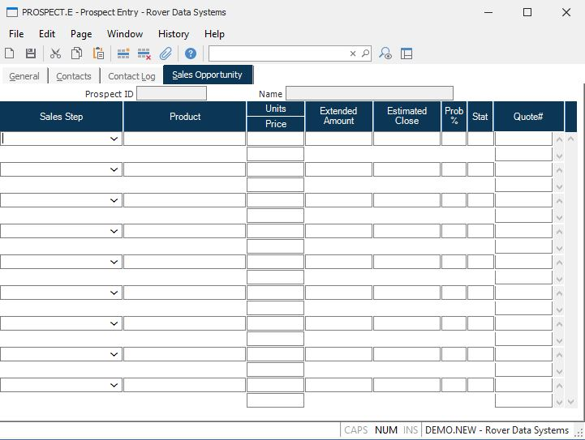

##  Prospect Entry (PROSPECT.E)

<PageHeader />

##  Sales Opportunity

**Prospect ID** This field contains the prospect ID from the first screen and
is for reference only.  
  
**Name** This field contains the prospect name from the first screen and is
for reference only.  
  
**Sales Stage** Select the sales step for this line. Valid entries are defined in the [ PROSPECT.CONTROL ](../../PROSPECT-CONTROL/README.md) procedure.   
  
**Sales Product** Enter the product being proposed for this sales stage.  
  
**Sales Units** Enter the number of units being proposed.  
  
**Sales Price** Enter the unit price for the product being sold.  
  
**Sales Ext** This field contains the total extended amount be proposed. If
both the units and price were entered, then this field is the extension of
those amounts. If units and price were left blank, then an extended amount may
be entered in this field.  
  
**Sales Close** Enter the estimated close date for this line.  
  
**Sales Prob** Enter the probablilty percentage that this item will close.  
  
**Sales Status** Enter the status code for this line. If valid status codes have been defined in [ PROSPECT.CONTROL ](../../PROSPECT-CONTROL/README.md) , then only those codes will be allowed.   
  
**Sales Quote** This field contains the sales order quotation for the SOQUOTE
file.  
  
  
<badge text= "Version 8.10.57" vertical="middle" />

<PageFooter />