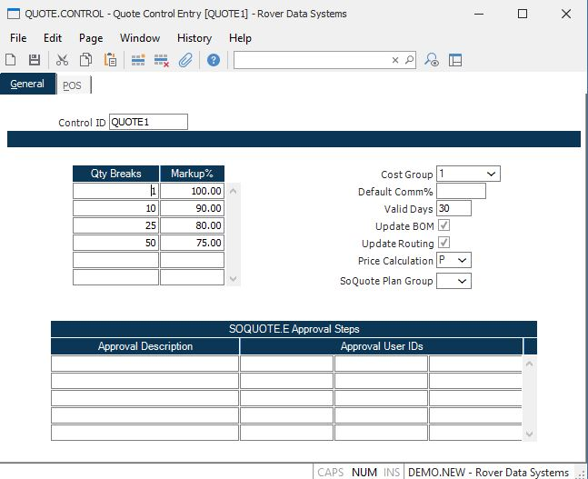

##  Quote Control Entry (QUOTE.CONTROL)

<PageHeader />

##

**Control.ID** The control id is the company code (as defined on screen 2 of
CO.CONTROL) preceded by "QUOTE". If you only have one company code the control
id will automatically be inserted into this procedure for you. If you have
multiple company codes you may select from a list of available companies or
you may enter the id directly e.g. QUOTE1. This record contains the default
information used in the QUOTE module by company code.  
  
**Qty Breaks** Enter the quantity breaks which will default into the quote
procedures. Once defaulted, they may be modified on the quote as required.  
  
**Markup%** Enter the default markup percent to be used for each quantity
break.  
  
**Cost Group** Enter the cost group which will be validated against [ INV.CONTROL ](../../../../INV-OVERVIEW/INV-ENTRY/INV-CONTROL/README.md) and used to determine the cost method for calculating material costs.   
  
**Default Comm%** Enter the default commission percent to use when calculating the total cost of the part being quoted. This percent will be defaulted into [ QUOTE.E ](../../QUOTE-E/README.md) in the event there is no specific rep identified on the Quote, or the rep has no commission percent assigned.   
  
**Valid Days** Enter the number of days which quotes are normally valid. This
field will be used to default the expiration date in the quote entry
procedures.  
  
**Update BOM** If you wish to allow the user to update the BOM when a quote is authorized, check this box. This will cause a message to appear at file time in [ QUOTE.E ](../../QUOTE-E/README.md) , prompting the user to approve updating the BOM.   
  
**Update Routing** If you wish to allow the user to update routings when a quote is authorized, check this box. This will cause a message to appear at file time in [ QUOTE.E ](../../QUOTE-E/README.md) , prompting the user to approve updating the   
  
**Price Calculation** This field will be used during [ SOQUOTE.E ](../../SOQUOTE-E/README.md) to load the price fields in the line items. "P" will use the price file for the associated   
quantity. "M" will use the cost data entered and the markup  
percentage to calculate the price.  
  
  
<badge text= "Version 8.10.57" vertical="middle" />

<PageFooter />