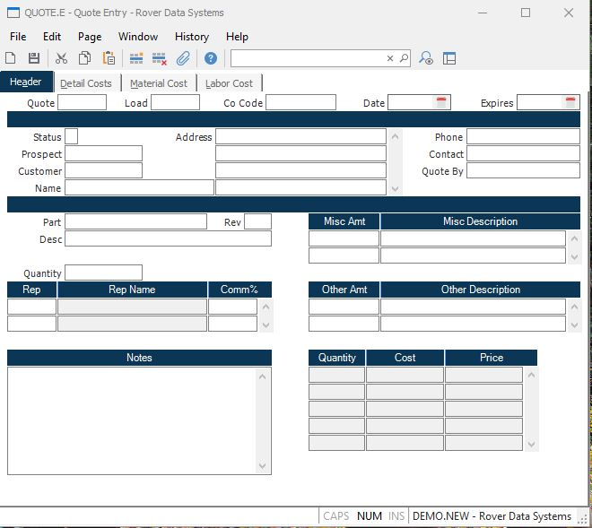

##  Quote Entry (QUOTE.E)

<PageHeader />

##  Header

**Quote.Number** Enter the number of the quote you wish to enter or update. To
assign a new, sequential quote number, leave this field null.  
  
**Load** If you wish to load an existing quote, enter that quote number here.  
  
**Co.Code** Enter the company code for this quote. If only one code exists it
will automatically be inserted into this procedure for you. The company code
must be predefined in the CO.CONTROL procedure.  
  
**Date** Enter the quote date as you want it to appear on the printed quote.  
  
**Expire Date** The date on which this quote expires. This is originally defaulted by adding the valid days from the [ QUOTE.CONTROL ](../../../../../../../../../../../../rover/AP-OVERVIEW/AP-ENTRY/AP-E/AP-E-1/CURRENCY-CONTROL/SO-E/MRK-CONTROL/MRK-CONTROL-1/SOQUOTE-E/SOQUOTE-E-1/QUOTE-CONTROL) screen to the quote date. It may then be changed as required.   
  
**Status** This field contains a code which identifies the current status of
the quote. When first entered, an "N" is automatically placed into this field.
When the quote has been approved for use on a sales order, enter "A". To close
or cancel a quote, enter "C".  
  
**Prospect** If you wish to load the name and address data from a prospect,
enter the prospect number.  
  
**Cust** Enter the number of the customer to which the part is being quoted.
The customer  
information will automatically be loaded from the customer file.  
  
**Name** The name of the customer as it appears in the customer file. It may
be changed here without affecting the customer master record.  
  
**Address** Enter the customer street address, city, state and zip code.  
  
**Phone** The telephone number of the customer.  
  
**Contact** The name of the contact person at the customer.  
  
**Quote.By** The name of the person who originated this quote.  
  
**Part** Enter the part number being quoted.  
  
**Rev** The revision number currently assigned to this part.  
  
**Desc** The description of the part being quoted.  
  
**Qty** This field is used to define the quantity being requested by the
customer. This is a text field only and is not used as part of the
calculations.  
  
**Rep** The rep number assigned to this customer.  
  
**Rep Name** The name of the rep as it appears in the Rep file.  
  
**Comm** The commission percentage given to the associated sales rep.  
  
**Misc.Amt** Enter any miscellaneous charges to be added to the bottom line of
the quote. This amount will not be use as part of the individual quantity
break calculations.  
  
**Misc.Desc** Enter a one line description to identify the miscellaneous
charge being applied.  
  
**Other** Enter any additional costs which will be applied to the unit cost
calculated for each quantity break.  
  
**Other.Desc** Enter a description of the other cost being applied.  
  
**Notes** Any miscellaneous notes about this quote.  
  
**Qty** The field contains the quantity breaks which are identified on the
detail screen. They are shown here for informational purposes only. All
changes must be made on the detail screen.  
  
**Cost** The field contains the tota costs which are identified on the detail
screen. They are shown here for informational purposes only. All changes must
be made on the detail screen.  
  
**Price** The field contains the prices which are identified on the detail
screen. They are shown here for informational purposes only. All changes must
be made on the detail screen.  
  
  
<badge text= "Version 8.10.57" vertical="middle" />

<PageFooter />