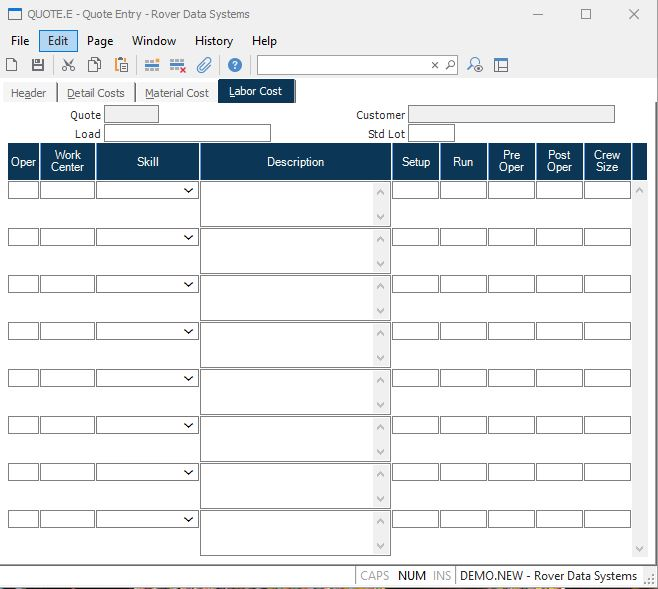

##  Quote Entry (QUOTE.E)

<PageHeader />

##  Labor Cost

**Quote#** The quote number is displayed here for reference.  
  
**Customer Name** The customer name is shown here for reference.  
  
**Load** If you wish to load (or reload) a routing from the master ROUTING
file, enter that number here.  
  
**Std.Lot** Enter the standard lot size to use for this routing.  
  
**Oper** Enter the operation (line item) number for each step of the routing.  
  
**Wk.Ctr** Enter the work center for the associated step on the routing.  
  
**Skill Code** Select the skill code, if any, required to perform this
operation.  
  
**Labor Desc** The description of the work center, as read from the WC file.
This description may be changed as required.  
  
**Setup** The setup hours for this step in the routing.  
  
**Run** The run hours for this work center.  
  
**Pre.Op** The number of preoperation hours required at the associated work
center.  
  
**Post.Op** Enter the number of post operation hours for the associated work
center.  
  
**Crew** Enter the crew size to be used at this step in the routing.  
  
  
<badge text= "Version 8.10.57" vertical="middle" />

<PageFooter />