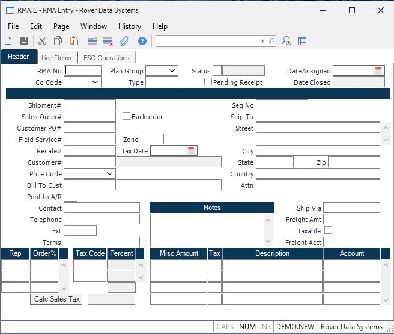

##  RMA Entry (RMA.E)

<PageHeader />

##  Header

**RMA Number** RMA numbers may be assigned manually or by the system when the
record is filed. If you are want the system to assign the RMA number then
leave the prompt blank. If you want to access an existing RMA you may enter
its number at this prompt.  
  
**Co Code** Enter the company code that the RMA is associated with.  
  
**Plan Group** Enter the planning group to be used for this RMA. This will
control the inventory locations which are defaulted in the line items.  
  
**Type** Enter the type code for the RMA.  
  
**Status** When an RMA is create the system will default the status of the RMA
to "O" (Open). After all of the items identified on the RMA have been received
the status will be set to "C" (Closed). If you want to close the RMA before
all of the items are received you may enter the letter "C" in this field.  
  
**Status** Shows the current status of the RMA which may "Open" or "Closed".  
  
**Pending Receipt** This box is checked if there is a pending receipt (not yet confirmed) for this RMA. A receipt is considered pending if the status on the receipt is set to "R" or �received�. When the status on the receipt is changed to "C" (for confirmed) via [ RMAREC.E2 ](RMAREC-E2/README.md) , this box will no longer appear as checked. This field is displayed for reference only and cannot be manually updated in this procedure.   
  
**Date Assigned** Enter the date on which the RMA was assigned. The system
will default the current date.  
  
**Date Received** The date on which the RMA was closed is displayed in the
field. When all of the items on the RMA have been received using the RMAREC
procedures the date of the last receipt will be loaded by the system.  
  
**Shipment#** If you know the number of the original shipment you may enter it
in this field. Doing so will cause the data from the original shipment to be
loaded into the RMA record where it can then be changed to reflect what
portion of the shipment is being returned.  
  
**Sales Order#** If you entered a valid shipment number the sales order number
for that shipment will be loaded into this field and may not be altered. If a
shipment number was not entered, and you know the number of the sales order
against which the items were shipped, you may enter it in this field.  
  
**Backorder SO** If a sales order number is present then you are given the option of backordering the quantity returned on the original sales order. The sales order can be backordered when the rma is created via RMA.E or when the rma receipt is posted via [ RMAREC.P1 ](../../../MRK-PROCESS/RMAREC-P1/README.md) . In [ MRK.CONTROL ](../../MRK-CONTROL/README.md) , you select the option to be used. If no option is selected in [ MRK.CONTROL ](../../MRK-CONTROL/README.md) and the "backorder?" box is checked, the sales order will be backordered from RMA.E.   
  
If you have opted to backorder the sales order via RMA.E, the backorder
quantity on the sales order will be updated each time you change the quantity
on the rma record. If you have opted to backorder at receipt time, the
backorder quantity on the sales order will become the quantity received. If
the rma receipt is reversed, the backorder quantity on the sales order will be
removed.  
  
**Customer PO#** If a shipment or sales order number were entered the
customer's purchase order will be loaded into this field and may not be
altered. If not, and you know the customer's purchase order number, you may
enter it in this field. If the purchase order number can be successfully
cross-referenced to a sales order number, then the sales order number will be
loaded in the sales order field.  
  
**FSO** If this RMA is for a field service order, enter the FSO# in this
field. Doing so will cause the data from the field service order to be loaded
into the RMA record where it can then be changed to reflect what portion of
the FSO is being returned or credited.  
  
**FSO Zone** Enter the geographic zone within which the equipment resides. The
zone is used in the calculation of service rates.  
  
**Customer#** If a sales order number is present the number of the customer
associated with the order  
is loaded in this field and may not be altered. If a number is not already
present then you must  
enter the number of the customer returning the items. If you do not know the
customer  
number, there is an option in the help menu for this prompt which allows you
to select the  
customer by name.  
  
**Cust Code** The customer or price code which can be used to modify pricing.
This field is originally defaulted from the customer file.  
  
**Bill To Cust** The number of the customer who's account will receive credit
for the return.  
  
**Credit Account?** If you want to credit the customer's account for costs on
the RMA then enter the letter "Y". This will cause a credit to be posted to
the accounts receivable balance for the customer. Enter the letter "N" if you
do not want to credit the account.  
  
**Contact** Enter the name of the person to be contacted at the customer
regarding the RMA.  
  
**Telephone** Enter the telephone number of the contact.  
  
**Ext** Enter the telephone extension for the contact.  
  
**Terms** Enter the terms code assigned to the bill to customer. This field is
originally defaulted from to bill to customer, or the Control record if there
is no terms code found.  
  
**Ship Seq No** Enter the shipping sequence number for this rma.  
  
**Ship Name** Enter the name of the company the material is being returned
from.  
  
**Ship.Address** Enter the ship to address to which the product was originally
shipped.  
  
**Ship City** Enter the city to which the product was originally shipped.  
  
**Ship State** Enter the state to which the product was originally shipped.  
  
**Ship Zip** Enter the zip code to which the product was originally shipped.  
  
**Ship Country** Enter the country to which the product was originally
shipped.  
  
**Ship Attn**  
  
**Ship Via** Enter the method of transportation to be used when the material
is being returned.  
  
**Freight Amount** Enter the freight dollars (if any) to be credited to the
customer account.  
  
**Freight Taxable** Check this box if the freight is taxable.  
  
**Freight Account#** Enter the account number to credit with the freight
dollars.  
  
**Notes** Enter any general purpose notes regarding the RMA.  
  
**Rep#** This prompt is associated with the order% prompt. You should enter
the number of each rep who had a percentage of the original order. If you do
not know the rep number, there is an option in the help menu for this prompt
which allows you to select the rep by name.  
  
**Order%** The order percent is associated with each rep entered and should
specify the percentage of the original sales order for the rep.  
  
**Tax Codes** The sales tax code(s) for the customer entered. This field is
originally loaded from the sales order, or the customer if no sales order has
been entered, and may be changed as required.  
  
**Tax Pct** The sales tax percent for the associated tax code.  
  
**Tax Rate** If any of the items being returned were subject to sales tax when
they were shipped, this is the tax percentage applied. This number is the sum
of the individual tax percentages above.  
  
**Misc Amount** This field is the first field of the set of 3 fields which
define miscellaneuos charges to be credited (Amount, Description, Account).
You may enter each charge in this field. You may also enter 'chargebacks' such
as restocking charges in this field as a negative number. This will result in
extending less credit to the customer for the return of the merchandise.  
  
**Misc Taxable** If the associated miscellaneous amount is taxable, enter 'Y'.  
  
**Misc Charge Description** Enter the description of the associated charge.  
  
**Misc G/L Acct#** Enter the account number to be credited with the associated
charge.  
  
**Customer Name** The customers name is displayed at this prompt and may not
be changed.  
  
**Bill To Name** The name from the CUST file for the bill to number.  
  
**Calc** Click this button to recalculate the sales tax rate.  
  
  
<badge text= "Version 8.10.57" vertical="middle" />

<PageFooter />