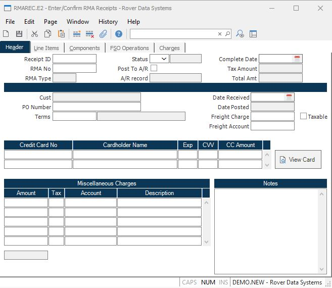

##  Enter/Confirm RMA Receipts (RMAREC.E2)

<PageHeader />

##  Header

**Receipt ID** Rma receipt numbers are assigned automatically by the system
when the record is filed. If you are creating a new receipt, you should leave
this prompt blank. If you want to make a change to an existing receipt, you
should enter the full rma receipt ID. The ID of a rma receipt is made up of
the rma order number followed by a sequential number maintained for each rma
order. For example, the first receipt for rma order 123 would be 123-1, the
second 123-2 etc.  
  
**RMA No** If you are creating a new receipt record, enter the RMA number
against which the items are being received at this prompt. You may not change
the RMA number on an existing receipt.  
  
**Status** Enter the status of the receipt. Valid options are "R" (received)
or "C" (confirmed). If the status is set to "P" (posted) you may not change
it.  
  
**Status Text** Contains text associated with the status code present:
Received, Confirmed or Posted.  
  
**Credit Memo** If the posting of the receipt resulted in the creation of a
credit memo, the credit memo number is displayed in this field. If, on the
other hand, chargeable items that have been added to the RMA receipt result in
an invoice, then the invoice number will display here.  
  
**Tax Amount** The amount of tax that will be applied to this a/r record. This
amount is displayed for reference only and cannot be changed.  
  
**Post To AR** Check this box if you wish to create an a/r record for this receipt. When the receipt is posted (via [ rmarec.p1 ](../../../MRK-PROCESS/RMAREC-P1/README.md) ) the "post to a/r" field in [ RMA.E ](../../RMA-E/README.md) will be updated.   
  
**Invoice Amount** This field contains the total value of this receipt
including freight, miscellaneous charges and tax.  
  
**Customer** Displays the customer for this rma.  
  
**PO** This field contains the customer purchase order number. It is originally defaulted from the [ RMA.E ](../../RMA-E/README.md) screen and can be changed, if required.   
  
**Terms** This field contains the terms code that will be used for any credits
and/or charges generated by this record.  
  
**Terms Desc** This field contains the terms description and is for reference
only.  
  
**Date Received** Enter the date on which the items were received. The current
date will be loaded automatically on new receipts.  
  
**Date Posted** If the receipt has already been posted then the date on which
the posting occured will be displayed in this field.  
  
**Freight Charge** Enter the amount to be credited for freight on this
receipt. If you are not giving credit for freight, but are charging for
freight then you may enter a negative amount in this field.  
  
**Freight Taxable** Check this box if the freight is taxable.  
  
**Freight Account** Enter the general ledger account number against which the
freight charge should be applied.  
  
**Creditcard No** Enter the credit card number for this transaction.  
  
**Creditcard Name** Enter the cardholder name for the associated credit card.  
  
**Creditcard Exp** Enter the credit card expiration date (MMYY)  
  
**Creditcard Cvv** This field should contain the credit card vaildation code.  
  
**Creditcard Amt** Enter the amount to be charged to the associated credit
card.  
  
**Misc Charges** Enter any miscellaneous charges that are to be credited back
to the customer. If any charge is to be billed back to the customer such as a
restocking or handling charge, it may be entered as a negative number.  
  
**Misc Taxable** Enter the letter "Y" if the associated charge is a table
item, otherwise enter "N" or leave the field blank.  
  
**Misc Account** Enter the general ledger account number to be used when
posting the associated charge.  
  
**Misc Desc** Enter a short description of the associated charge.  
  
**Total Misc Charges** Contains the total amount for all miscellaneous
charges. This field is displayed for reference only and cannot be changed.  
  
**Notes** Enter any general notes applicable to the items received. If notes
were present on the original RMA they will be loaded into this field.  
  
**Type** The type code for the RMA displayed for information only.  
  
**View Card** Select this button to view the actual credit card number. This
will only be allowed if you are secured to view credit card.  
  
  
<badge text= "Version 8.10.57" vertical="middle" />

<PageFooter />