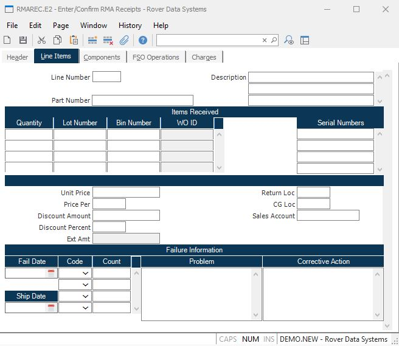

##  Enter/Confirm RMA Receipts (RMAREC.E2)

<PageHeader />

##  Line Items

**Li No** Contains the line item associated with the item being received. This
information is loaded from the RMA record and may not be changed. Line items
that do not have a quantity received will be removed when the record is saved.
If you wish to add a line item to the receipt, enter "N" for the line number.
New line items will be added to the RMA when the record is saved.  
  
  
**Part Id** Contains the part number of the item being received. This information is defined in the [ RMA.E ](../../RMA-E/README.md) procedure and may not be changed.   
  
**Description** Contains the description of the item being received as defined in the [ RMA.E ](../../RMA-E/README.md) procedure. This information may not be changed.   
  
**Quantity** Enter the number of items being received for a given lot number
destined for a particular bin number. Multiple entries are permitted provided
they do not exceed the total quantity defined on the RMA less any previous
receipts.  
  
**Lot Number** If the associated part number is lot controlled, enter the lot
number associated with the quantity received.  
  
**Bin** If the inventory location into which the part numbers are being moved
is bin controlled, then enter the bin location into which the parts will be
placed.  
  
**WO ID** Displays the work order, if any, associated with the quantity received. This field may not be changed. A work order is generated for the part(s) when the RMA receipt is confirmed. To generate the work order, the RMA type used must be associated with a valid work order repair code in [ MRK.CONTROL ](../../MRK-CONTROL/README.md) .   
  
**Serial No** If the items being returned are identified by serial numbers,
then enter the serial number of each item being received.  
  
**Unit Price** Enter the unit price of the items being received. This price
will be used in calculating the credit amount.  
  
**Price Per** The price per will be loaded from the RMA line item. It can be
entered or changed as required. It is used in conjunction with the price in
the calculation of the credit to the customer account.  
  
**Unit Disc Amt** Enter the amount by which the price is to be reduced as a
discount.  
  
**Disc Percent** Enter the percentage by which the price is to be discounted.  
  
**Return Loc** Enter the inventory location into which the parts are to be
received. If there is no part number leave this field blank.  
  
**Line Item Amount** Contains the total amount of this line item before taxes.  
  
**CG Loc** Enter the cost of goods location from which the parts are to be
received. The account number defined for this location will be credited with
the cost of the item.  
  
**Sales Account** Enter the general ledger account number for the sales
account that will be used to offset the credit memo.  
  
**Failure Date** If these items are being returned due to a failure, then
enter the date on which the failure occured.  
  
**Ship Date** Enter the date on which the units were originally shipped. This
date is used in calculating the mean time between failure.  
  
**Failure Code** Enter each of the failure codes that apply to the items
received.  
  
**Failure Count** Enter the number of items received on the line item that
exhibited the failure identified by the associated failure code.  
  
**Problem** Indicate the specific nature of the problem with the units
received in this field. If probem information was entered on the RMA it will
be loaded into this field.  
  
**Corr Action** Enter a description of the corrective action taken on the
returned items. Corrective action information entered in the RMA will be
loaded into this field.  
  
  
<badge text= "Version 8.10.57" vertical="middle" />

<PageFooter />