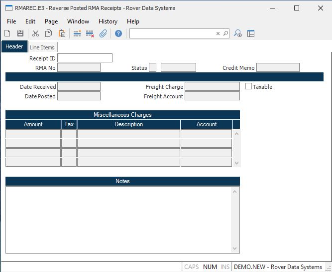

##  Reverse Posted RMA Receipts (RMAREC.E3)

<PageHeader />

##  Header

**Receipt ID** Enter the receipt number to be reversed. Only receipts with a
status of "posted" may be entered.  
  
**RMA No** Displays the date on which the items were received.  
  
**Status** Displays the status of the receipt; R - Received, C - Confirmed, P
- Posted.  
  
**Status Text** Contains text associated with the status code present:
Received, Confirmed or Posted.  
  
**Date Received** Shows the date on which the items were recevied.  
  
**Date Posted** Displays the date on which the receipt was posted.  
Posting occurs after the recipt has been confirmed.  
  
**Credit Memo** If the posting of the receipt resulting in the creation of a
credit memo, the credit memo number is displayed in this field.  
  
**Freight Charge** Displays the amount of freight charges credited to the
customer.  
  
**Freight Taxable** This box will be checked if the freight was taxable.  
  
**Freight Account** The general ledger account number for the freight charges.  
  
**Misc Charges** Miscellaneous charges that were credited to the customer.  
  
**Misc Taxable** A "Y" in this field indicates that sales tax was credited for
the associated charge.  
  
**Misc Desc** The description of the associated miscellaneous charge.  
  
**Misc Account** The general ledger account number associated with the charge.  
  
**Notes** Conatins general notes regarding the receipt.  
  
  
<badge text= "Version 8.10.57" vertical="middle" />

<PageFooter />