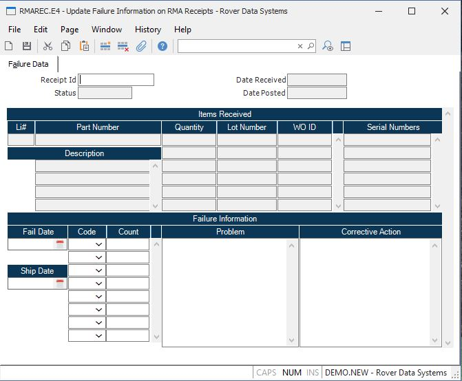

##  Update Failure Information on RMA Receipts (RMAREC.E4)

<PageHeader />

##  Failure Data

**Receipt ID** Enter the number of the RMA receipt whose failure statistics
are to be updated.  
  
**Status** Displays the current status of the RMA receipt; Received, Confirmed
or Posted.  
  
**Date Received** The date on which the items were received.  
  
**Date Posted** If the receipt has been posted to accounts receivable,
creating a credit memo if specified, then the date on which the posting took
place is displayed in this field.  
  
**Li No** Contains the line item associated with the item received.  
  
**Part Id** Contains the part number of the item being received.  
  
**Description** Contains the description of the item being received as defined in the [ RMA.E ](../../RMA-E/README.md) procedure.   
  
**Quantity** The quantities of the items received associated with the lot
number and bin location into which they were received.  
  
**Lot Number** The lot numbers of each of the items received.  
  
**WO ID** Displays the work order number, if any assigned to the associated
quantity. It may not be changed.  
  
**Serial No** A list of all the serial numbers received on the line item.  
  
**Failure Date** Enter the date on which the units failed.  
  
**Failure Code** Enter each of the failure codes that apply to the units
received.  
  
**Failure Count** Enter the number of items that exhibited the properties of
the associated failure code.  
  
**Ship Date** Enter the date on which the units originally shipped.  
  
**Problem** Enter a description of the problem found with the items on the
associated line item.  
  
**Corr Action** Enter a description of the corrective action taken to solve
the problem with the items returned.  
  
  
<badge text= "Version 8.10.57" vertical="middle" />

<PageFooter />