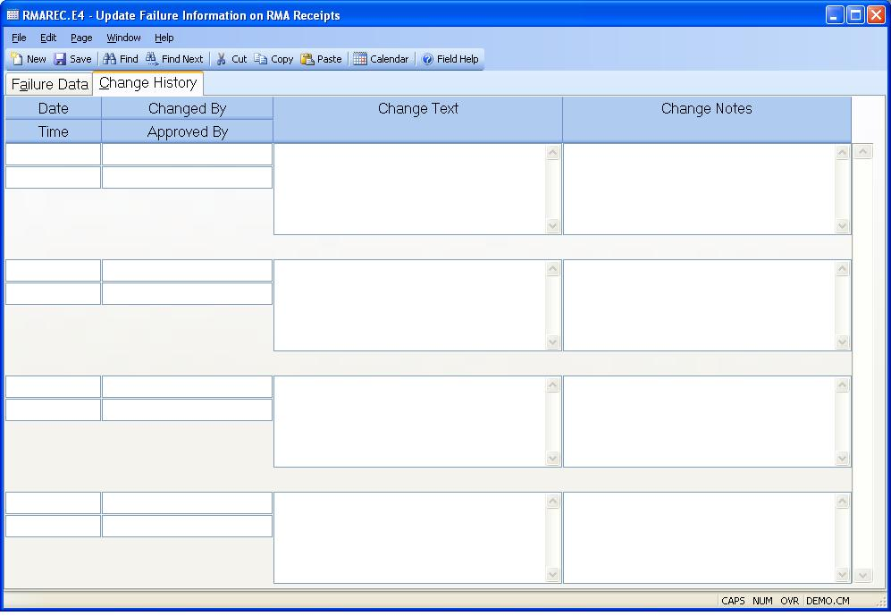

##  Update Failure Information on RMA Receipts (RMAREC.E4)

<PageHeader />

##  Change History

**Change Date** This field contains the date the rma receipt was changed. It
is is displayed for reference only and cannot be changed.  
  
**Change Time** This field contains the time the rma receipt was changed. It
is is displayed for reference only and cannot be changed.  
  
**Changed By** This field contains the user id of the individual who changed
the record. It is displayed for reference only and cannot be changed.  
  
**Approved By** Enter the name or initials of the person who approved the
associated changed.  
  
**Change Text** This is change text that is generated by the system based on the settings in [ CHANGE.CONTROL ](../../../../ACE-OVERVIEW/ACE-ENTRY/CHANGE-CONTROL/README.md) defining which fields trigger a change. Changes to those fields will be noted here. This text will also be included in RMA receipt change notices sent by email.   
  
**Change Notes** Enter any notes associated with changes made on this date and
time. These notes will also be included in RMA receipt change notices sent by
email.  
  
  
<badge text= "Version 8.10.57" vertical="middle" />

<PageFooter />