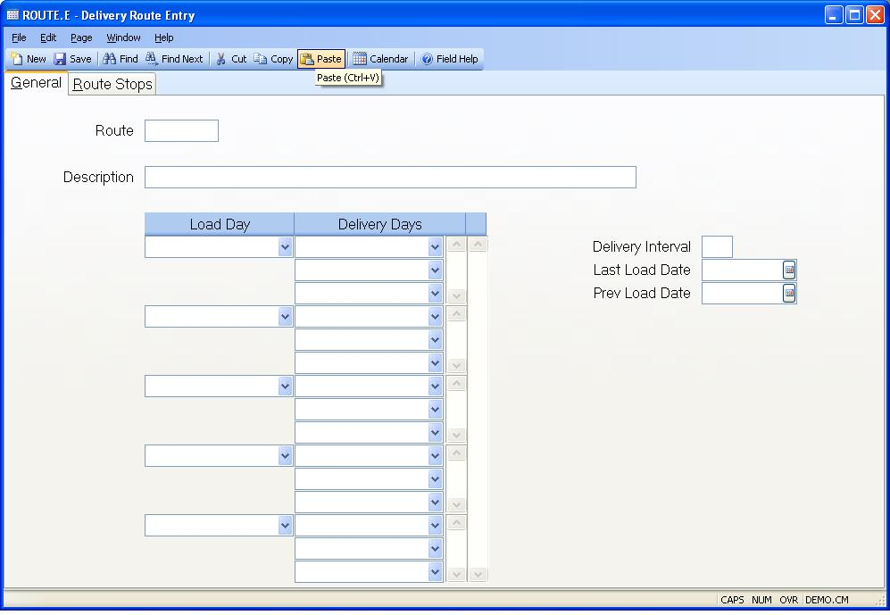

##  Delivery Route Entry (ROUTE.E)

<PageHeader />

##  General

**Route.ID** Enter a Route number or ID. Leave blank to have the system assign
the next sequential route # for a new route.  
  
**Description** Enter a description of this delivery route.  
  
**Load Day** Enter the load day for the corresponding delivery days. A right
click option will allow selection of day.  
  
**Deliver Day** Enter the delivery day(s) for the corresponding load day. A
right click option will allow selection of day(s).  
  
**Load Interval** If this is a weekly delivery, then leave this field blank.
Otherwise, enter the number of calendar days between deliveries. For instance,
a bi-weekly interval would be 14 days. When routeship records are created in
batch mode, this interval will be checked to see if this route is due to be
scheduled.  
  
**Last Load Date** This is the last load date that was associated with this route. This is updated when routeship records are created via [ ROUTESHIP.E ](../../ROUTESHIP-E/README.md) or [ ROUTESHIP.P1 ](../../../MRK-PROCESS/ROUTESHIP-P1/README.md) . It can also be changed here to control when the next shipment delivery will be scheduled for this route. It is used in conjunction with the delivery interval period. If no delivery interval is specified, then it is just for information only.   
  
**Previous Load Date** This is the previous load date that was associated with
this route. This is kept for information only in case the latest routeship
record is deleted.  
  
  
<badge text= "Version 8.10.57" vertical="middle" />

<PageFooter />