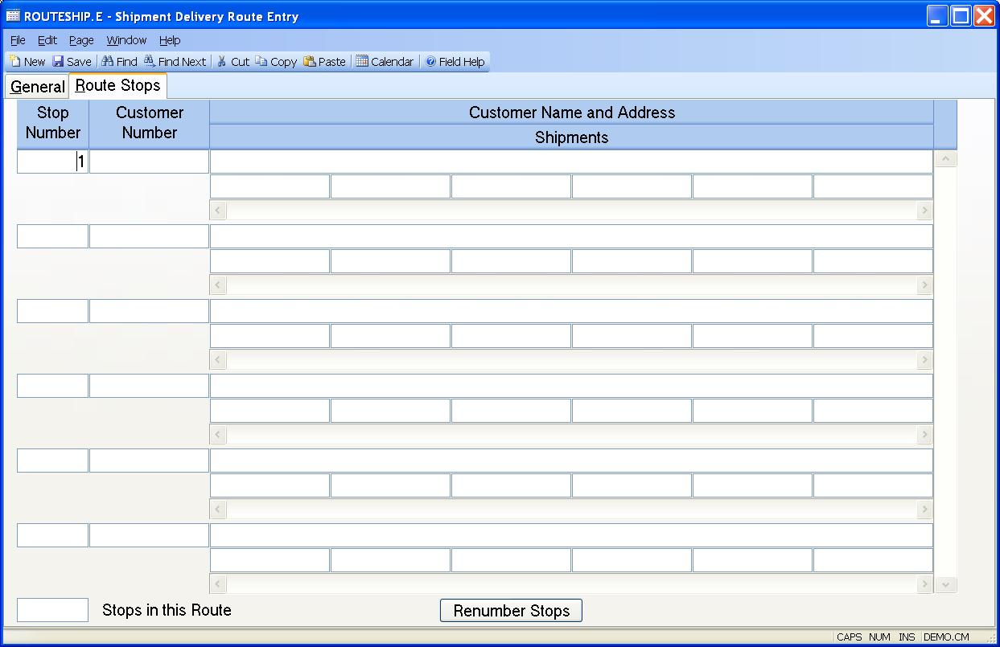

##  Shipment Delivery Route Entry (ROUTESHIP.E)

<PageHeader />

##  Route Stops

**Stop Nbr** These stops were loaded based on the shipments eligible for the
route number entered. They can be added to, changed or deleted. To renumber
the stops sequentially, use the button below.  
  
**Cust Id** This is the customer ID for the stop. It will be defaulted from
the route entered, but can be changed.  
  
**Cust Name** The customer name and the address associated with the customer's
shipments.  
  
**Ship Id** Enter the shipments to be delivered for this customer. They will
be defaulted from the route entered, or they can be added to or changed.  
  
**Nbr of Stops** The total number of stops in this route.  
  
**Renumber Stops** Use this function to renumber the stops sequentially
starting at 1.  
  
  
<badge text= "Version 8.10.57" vertical="middle" />

<PageFooter />