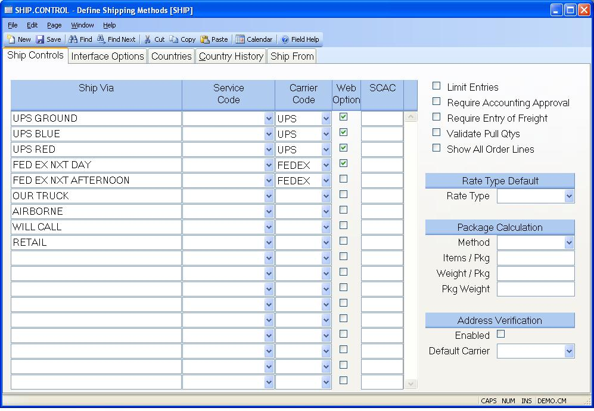

##  Define Shipping Methods (SHIP.CONTROL)

<PageHeader />

##  Ship Controls

** ** The word "Ship" will default in this prompt.  
  
**Ship Via** Enter any valid ship via code which can be used in the sales
order and shipping process. The entry of ship via code will be validated from
this list based on the "limit entries" checkbox to the right. If it is
checked, the customer, order and shipping process will require that the entry
of a ship via code be present in this list. If it is not checked, any code can
be entered in those procedures.  
  
**Service Code** Enter a valid service code if the carrier is UPS and you want
the system to automatically derive frieght charges from the UPS system based
on the sales order weight and packaging.  
  
**Carrier Code** Enter the freight carrier which is to be interfaced. For
example, if you are interfacing to the UPS system, the freight amount must be
either downloaded or manually entered before allowing posting. Leave this
field empty if no automatic interfacing is to occur for this ship via.  
  
**Website Option** Check this box if the associated shipping method should be
offered to customers placing orders via the website.  
  
**SCAC** Enter the Standard Carrier Alpha Code (SCAC) that identifies the
associated freight carrier and shipping method. There is a separate SCAC code
for each shipping method for a given carrier.  
  
**Limit Entries** Check this box if you wish to limit the entry of shipping
methods to those found in this record. If you will be importing/exporting data
with the freight carrier, this box should be checked.  
  
**Require Approval?** If you wish to require approval of a shipment before allowing posting to Accounts Receivable, then check this box. If checked, then shipments must be approved by the [ SHIP.E4 ](SHIP-E4/README.md) procedure before posting. If not, then shipments processed with [ SHIP.E2 ](SHIP-E2/README.md) and a status of "S" will be posted to AR by [ SHIP.P1 ](../../../MRK-PROCESS/SHIP-P1/README.md) .   
  
**Require Freight Entry** Check this box, if an entry (including zero) must be made to the freight field in [ ship.e2 ](../../../../duplicates/ship-e2/README.md) before the record can be posted. The option should be used when importing data from a freight carrier as a means to ensure that the freight has been added to the shipper.   
  
**Validate Pull Qty?** If this option is checked, then shipment quantities must be pulled through the bar code shipment process, SHIP.BE, which will move the inventory to a staging area from the FG locations on the shipment line items. This will be done for status "N" shipments, and the shipment cannot be changed to status "S" until all line item quantities have been pulled equal to the quantity required for each. SHIP.BE will change the location of each line item to the staging location, and the "pull date" will be set for the shipment, allowing it to be changed to status "S" on [ SHIP.E2 ](SHIP-E2/README.md) . If this is not checked then shipments will process as normal through [ SHIP.E2 ](SHIP-E2/README.md) .   
  
**Show All SO Lines** Select this box if you wish to show line items from the
sales order on the packing list, even when no quantities for that line are
being shipped. If this box is not selected, then only lines that contain ship
quantities will be displayed.  
  
**Default Rate Type** Select the way in which the freight values defined are
to be presented to the user. This will be the default for all carriers unless
a carrier specific rate type is defined on the interface options tab.  
  
Actual - These are the charges that will actually be incurred by the customer.  
  
Estimate - These amounts represent only estimates. The actual amount will be
determined at time of shipment.  
  
TBD - To be determined. The amounts are not known and will be determined at
time of shipment. This essentially ignores all of the other paramenters you've
defined for freight charges.  
  
If no type is specified then TBD is assumed.  
  
**Package Method** Select the method to use when calculating the number of
packages that will be required for an order. This information is used in the
calculation of the freight cost. Available options are:  
  
None - No calculation is performed. A package count of 1 is used.  
Items - Package count is calculated based on the number of items.  
  
None - No calculation is performed. A package count of 1 is used.  
Items - Package count is calculated based on the number of items.  
Weight - Package count is calculated based on the total weight of the items.  
  
**Items Per Pkg** If the package calculation method is set to "Items" enter
the number of items that are normally shipped in one package. When calculating
the number packages the system will take the total quantity of items on the
order and divide it by the number entered in this field. For example, if the
quantity of items on the order is 12 and 5 is present in this field the system
will calculate that 3 packages are required.  
  
**Weight Per Package** If the package calculation method is set to "Weight"
enter the weight that is normally shipped in one package. When calculating the
number packages the system will take the total weight of the items on the
order and divide it by the number entered in this field. For example, if the
weight of the items on the order is 12 and 5 is present in this field the
system will calculate that 3 packages are required.  
  
**Pkg Weight** Enter the weight to be added to each package to account for the
weight of the packaging itself.  
  
**Address Verification Enabled** Check this box if the ability to validate a
shipping address is to be enabled.  
  
**Address Validation Default Carrier** Select the carrier whos address
validation service is to be used by default when validating addresses that are
not already associated with a carrier or when the carrier does not provide an
address validation web service.  
  
  
<badge text= "Version 8.10.57" vertical="middle" />

<PageFooter />