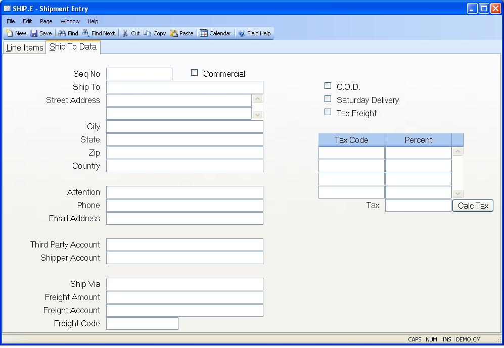

##  Shipment Entry (SHIP.E)

<PageHeader />

##  Ship To Data

**Ship Seq No** Contains the shipping sequence number defined in [ cust.e ](cust-e/README.md) . If present, this number will default in for you from [ so.e ](so-e/README.md) but can be changed as required. There is a right click option to display all shipping addresses available for this customer.   
  
**Commercial?** Check this box if the shipment is being sent to a commercial
address.  
  
**Ship Name** Enter the name of the company the shipment will be sent to.  
  
**Ship To Address** Contains the ship to name and address as shown on the
sales order. This data is defaulted in from the sales order record and may be
changed as required. Please note that if you will be interfacing to the
Federal Express Software System, you are only allowed to bring over two lines
of the shipping address.  
  
**Ship City** The city the shipment is being delivered to.  
  
**Ship State** The state the shipment is being delivered to.  
  
**Ship Zip** The zip/postal code the shipment is being delivered to.  
  
**Ship Country** Enter the country this shipment will be sent to. Please note that you may be required to enter the country name as it has been entered in the [ SHIP.CONTROL ](../../SHIP-CONTROL/README.md) procedure. For example, instead of entering U.S.A. you may need to enter United States. If this requirement has been applied to your account, an error message will be displayed if the entry made into this field does not match the entry found in [ ship.control ](../../../../../../../../../../rover/AP-OVERVIEW/AP-ENTRY/ACCT-CONTROL/ACCT-CONTROL-1/ar-e/CUST-E/CUST-E-8/ship-control) .   
  
**Ship Attn** Enter the name of the person or contact that this shipment is
being delivered to.  
  
**Ship Phone** The phone number associated with the ship address.  
  
**Email Address** Enter the email address that should be used when notifying
the customer of the shipment.  
  
**Third Party Account** Enter the account number for that should be charged if
the shipment will be paid by a third party. This number will only be
passed/interfaced to the freight carrier's software if the freight code is "T"
for third party.  
  
**Shipper Account** If required, enter the shipper's / company's account
number in this field.  
  
**Via** Contains the shipping method for this shipment. When the shipper is
initially created, the ship via will be loaded in from the sales order but can
be changed as required.  
  
**Freight Charges** Enter the freight charges that should be billed to the customer against this to this shipper in this field. If a freight charge was entered on the sales order (via [ SO.E ](../../SO-E/README.md) ) with a freight type of ACTUAL, the freight amount will be loaded into this field for you but can be changed as required.   
  
**Freight Acct** Enter the freight account that the freight charges should be posted against. The account number is defaulted initially from the [ MRK.CONTROL ](../../MRK-CONTROL/README.md) record.   
  
**Freight Code** Enter the letter "P" if the freight charges for the shipment
are being prepaid. Enter "C" if the charges are to be collected from the
customer by the carrier. Enter the letter "T" if the charges are to be paid by
a third party. Enter the letter "F" if no freight charges are to be billed to
the customer.  
  
**Cod** Check this box if the shipment is to be sent C.O.D. (cash on
delivery).  
  
**Saturday Delivery** Check this box if the order will be delivered on a
Saturday.  
  
**Freight Taxable** Check this box if freight charges are to be taxed.  
  
**Tax Codes** Enter the sales tax code(s) to be used for this shipment. These
codes are originally defaulted from the sales order. They are reloaded if a
different ship address is selected from the customer ship to address list.
They may be changed manually, as required.  
  
If a resale number is entered on the header tab of [ SO.E ](../../SO-E/README.md) , tax will not be applied to the line items or miscellaneous charges. However, tax will applied to the freight if the freight amount is flagged as taxable.   
  
**Tax Pcts** Displays the tax percentage for the associated tax code.  
  
**Total Tax Rate** The total sales tax rate.  
  
**Calc Tax** Click this button to recalculate the sales tax rate.  
  
  
<badge text= "Version 8.10.57" vertical="middle" />

<PageFooter />