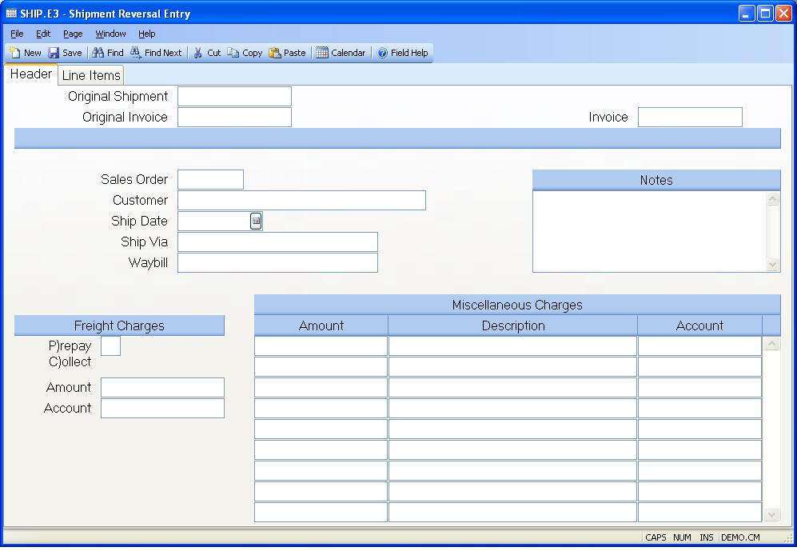

##  Shipment Reversal Entry (SHIP.E3)

<PageHeader />

##  Header

**Shipment Number** Shipment numbers are assigned automatically by the system
when the record is filed. Since you may not enter existing shipment numbers,
this field is not prompted on the screen.  
  
**Original Shipment** Enter the number of the shipment record you want to
reverse. Only shipments with a status of "P" (posted) may be reversed.  
  
**Original Invoice** This field contains the invoice number that was created
for the original shipment.  
  
**Invoice#** This field contains the invoice number assigned to this shipment. If you have selected the option in [ MRK.CONTROL ](../../MRK-CONTROL/README.md) to assign invoices manually, the original invoice number prefaced by an "R" will be loaded into this field for you but can be changed as required. If you have opted to assign the invoice number at ship or post time, no invoice number will loaded into this field for you and you will not be able to enter a number.   
  
**Sales Order Number** Contains the sales order number associated with the
shipment.  
  
**Customer** Contains the name of the customer assigned to the sales order.  
  
**Date** The date loaded into this field by the system is the ship date on the
original shipment record. It may be changed to another date for the reversal
if appropriate, but may not be less than the original shipment date.  
  
**Ship Via** Contains the method of shipment or carrier called out on the
original shipment.  
  
**Waybill#** The number of the waybill which was entered on the original
shipment.  
  
**Notes** The notes from the original shipment record are defaulted into this
field, but they may be changed to describe the reason for the reversal.  
  
**P)repay C)ollect** Contains the letter "P" if the freight charges on the
original shipment were prepaid or "C" if the charges were to be collected from
the customer by the carrier.  
  
**Freight Amount** The original freight charges from the shipment preceded by
a minus sign (-) is stored in this field.  
  
**Freight Account#** Contains the freight account number from the original
shipment record.  
  
**Misc Charge Amount** The miscellaneous charges shown are from the original
shipment and are shown as negatives on the reversal.  
  
**Misc Charge Description** Contains the one line description of the charge
from the original shipment record.  
  
**Misc Charge G/L Acct#** Contains the general ledger account number from the
original shipment for the miscellaneous charges.  
  
  
<badge text= "Version 8.10.57" vertical="middle" />

<PageFooter />