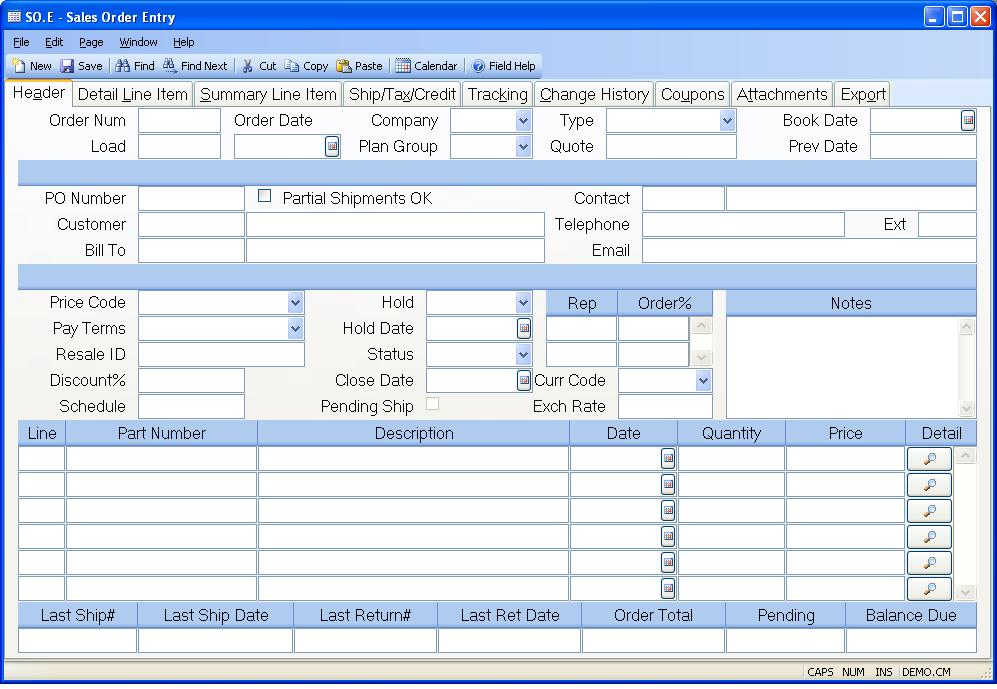

##  Sales Order Entry (SO.E)

<PageHeader />

##  Header

**SO Number** Enter the sales order number, or leave blank to assign the next
sequential number. You may enter a new number, or the number of an existing
order. The help menu also contains an option which allows you to enter the
customer PO number to find the sales order number.  
  
**Load** If you wish to create a new sales order from an existing order, enter
the existing SO number here. This function can only be used with new records.  
  
**Date** Enter the date on which the sales order was created. The current date
will be automatically loaded, but may be changed.  
  
**Company** Enter the company code that is to be associated with the order.
The company code must be defined in advance in the CO.CONTROL procedure. If
only one company code exists it will be defaulted into the field for you.  
  
**Plan Group** Enter the planning group assigned to the sales order. This will
be used to default the correct finished goods location into the line items.  
  
**Type** Enter or select the order type to be used with the sales order. Order types are available as filtering options in many standard sales order reports and are defined in the [ MRK.CONTROL ](../../MRK-CONTROL/README.md) procedure. If the order types have been defined in the [ MRK.CONTROL ](../../MRK-CONTROL/README.md) procedure, the description for the type codes can be displayed in a drop down list from this field. When entering an order type that has not been defined in the [ MRK.CONTROL ](../../MRK-CONTROL/README.md) procedure, enter the code (1 character) and not the description.   
  
**Quote** Enter the SOQUOTE number you wish to load. This field will load an
entire quote into the sales order. Use the line item quote field to enter
individual line items.  
  
**Book Date** ontains the date to be used in posting the net change to the
bookings, if any, as a result of changing the sales order. The current date is
loaded by the system as the default since this should be the date used unless
there are special circumstances which require the date to be set differently.
You may prevent the creation of booking records by leaving this field blank
when the order is first entered. If you decide later that the order should be
booked, you may enter a date at that time. Also, if an existing record was
already booked, you may unbook it by leaving this field blank. In this case
the unbooking will be done on the current date.  
  
**Last Book Date** Contains the date used to create the last set of booking
records posted for the sales order. The date is displayed for information only
and may not be changed.  
  
**PO Number** Enter the customer's PO number. This number will be cross
referenced to the sales order number so that the order can be retrieved by the
customer's PO number.  
  
**Customer#** Enter the number which identifies the customer who authorized
the sales order. An option in the help menu allows you to display all of the
customer numbers for the name you enter.  
  
**Customer Name** Contains the name of the customer identified by the customer
number entered. The contents of the field may nat be changed.  
  
**Bill To** Enter the number of the customer who will be billed for this
order. This number is defaulted from the CUST file and may be changed if
required.  
  
**Bill To Name** The name of the bill to customer. This is displayed for
verification purposes.  
  
**Contact Id** Enter the ID of the customer contact associated with the order.
The system will load the default contact automatically from the list of
contacts in the customer master record. You may select another contact by
typing all or part of a word in the contact's name or use the right click menu
to select from a list of contacts associated with the customer. The right
click menu also includes an option to add a new contact to the system. If a
new contact is created it will be added to the list of customer contacts when
the sales order is saved.  
  
**Partial Ok** Check this box if partial shipments may be made against this
order. This entry is initially set to the default setting defined in the
customer record for the customer entered.  
  
**Contact** Enter the name of the person to contact with the customer
regarding the sales order.  
  
**Telephone** Enter the customer phone number. The recommended format is
XXX/XXX-XXXX.  
  
**Ext** Enter the phone extension for the associated contact and phone.  
  
**Email** Enter the email address of the order contact person.  
  
**Price Code** Select the price code for this order. This code in conjunction with each part on the order is used to determine pricing for the items. This field is originally defaulted from the customer. The price codes are defined in [ PRICE.CONTROL ](../../PRICE-CONTROL/README.md) .   
  
**Pay Terms** Select the payment terms that are to be applied to invoices
generated against the sales order.  
  
**Resale#** Enter the customer's resale number if tax will not be applied to
the order because the customer is reselling the items or including them into
another product which will be sold.  
  
**Discount%** If you wish to default a discount percent into each line of the
order, enter that discount here. After the order is filed, this field is
removed to prevent confusion in the event that lines may contain varying
discounts.  
  
**Sched** If you wish to default a schedule date into each line of the order,
enter that date here. If a delivery route has been entered for the customer,
then the next delivery date after today's date will be defaulted here. After
the order is filed, this field is removed to prevent confusion in the event
that lines may contain varying schedule dates.  
  
**Hold Code** Select the hold code to be used with the order. Hold codes are defined in the [ MRK.CONTROL ](../../MRK-CONTROL/README.md) procedure. The purpose of placing an order on credit hold is to prevent a shipment from being processed. Hold orders are also not included in MRP. If the bill to customer is put on credit hold shipments are prevented from being processed regardless of whether this field is used.   
  
**Hold Date** Enter the date on which the order was placed on hold.  
  
**Status** This field displays the current status of the sales order. The
three possible states are "New", "Backorder" and "Closed". The status is set
automatically by the system based on activity tat has occured. When an order
is first entered the status is set to "New". If a partial shipment is made
against the order the status is set to "Backorder". After all items have been
shipped the status is set to "Closed". You may manually change the status of a
sales order to closed which will automatically reduce all of the remaining
open balances on the order to zero.  
  
**Close Date** Enter the date on which this order was closed or cancelled. The
date is automatically set by the system when the last shipment is posted.  
  
**Pending Ship** This box is checked if there is a pending shipment (not yet shipped) for this sales order. A shipper is considered pending if the status on the associated shipper is set to "N" or New. When the status on the shipper is changed to "S" (for shipped) via [ SHIP.E2 ](../../SHIP-E2/README.md) , this box will no longer appear as checked. This field is displayed for reference only and cannot be manually updated in this procedure.   
  
**Rep** Enter the rep(s) receiving credit for this order. This field is
related to the Order% field and you may enter as many reps and order
percentages as required. If you do not know the rep number, there is an option
in the help menu for this prompt which allows you to select the rep by name.  
  
**Order%** Enter the percent of the order credited to the associated sales
rep. This field can total more than 100%.  
  
**Currency Code** If the order is to be placed in a foreign currency, enter the currency code here. That will load the exchange rate defined in [ CURRENCY.CONTROL ](../../../../AR-OVERVIEW/AR-ENTRY/CURRENCY-CONTROL/README.md) .   
  
**Exchange Rate** This is the exchange rate associated with the currency code as defined in [ CURRENCY.CONTROL ](../../../../AR-OVERVIEW/AR-ENTRY/CURRENCY-CONTROL/README.md) . It can be changed as needed.   
  
**Notes** Enter any notes that apply to the entire sales order. These notes will appear on the sales order acknowlegment. If you have predefined notes available you may load them by selecting the appropriate option from the help menu for this prompt. You may, also, load in notes from the customer record automically by setting the "Load Customer Notes" field to "Y" in the [ MRK.CONTROL ](../../MRK-CONTROL/README.md) procedure. If, the customer number changes on an existing sales order, the customer notes will only be loaded in if the SO notes field is empty.   
  
**Header Line** Enter the line item number for the associated item. If you are
using sequential line numbers you may enter the letter "N" in this field to
cause the next sequential line number to be calculated and entered. If you
enter the letter "N" on an existing line a new line number will be added to
the end of the list.  
  
**Header Part Number** Enter the part number being ordered. If the item being
ordered does not have a part number then leave this field blank and enter a
description of the item in the description field.  
  
**Header Description** If a part number was entered then the description will
be loaded automatically from the parts master file and may be modified if
required. If no part number was entered you should enter a description of the
item being ordered.  
  
**Schedule Date** Enter the date on which the associated item is to be
shipped. If a date was entered in the schedule date field it will be used as
the default for new line items. Note: If the line item already exists and more
than one schedule date has been defined for the line on the detail page then
the word "Multiple" will appear in this field and you will not be allowed to
change the date using this field. You will need to use the detail page
instead.  
  
**Header Quantity** Enter the quantity of the item being ordered. This field
always displays the total quantity ordered for the line item. If multiple
schedule dates and quantities were entered on the detail page then you will
not be allowed to change the quantity in this field. You will need to make
your changes on the detail page.  
  
**Header Price** Enter the price for the associated item. If a part number was
entered and a pricing table has been defined for it the price will be loaded
automatically and can be changed if required.  
  
**** Click this button to jump to the detail page for the associated line
item.  
  
**Last Shipment#** Contains the number of the last shipment created against
the sales order. This is the sequential number portion of the shipper ID. The
full shipment ID is the sales order number followed by a dash (-) followed by
this number.  
  
**Last Ship Date** The date the last shipment was posted against the sales
order.  
  
**Last Return#** Contains the number assigned to the last returned shipment on
the sales order. The data is for information only and may not be changed.  
  
**Last Ret Date** Contains the date on which the last return was posted. The
data is system controlled and may not be changed.  
  
**Total Value** Contains the total dollar value of the order. The amount is
calculated by the system based on the unit price and schedule quantities for
each line item. If a line item is flagged as taxable, the tax amount will be
calculated and included in this total. This field may not be changed directly.  
  
**Released Shipments** Contains the dollar value of all of the items which
have pending (unshipped) shipments.  
  
**Balance Due** Contains the dollar value of the order for all of the items
which have not shipped. This figure is the sum of all the open balances for
each line item.  
  
  
<badge text= "Version 8.10.57" vertical="middle" />

<PageFooter />