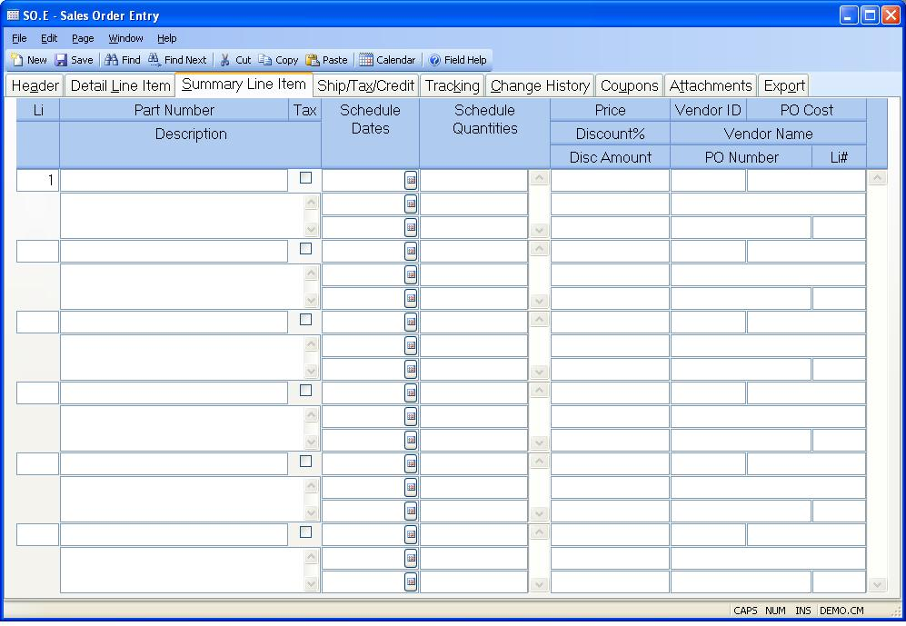

##  Sales Order Entry (SO.E)

<PageHeader />

##  Summary Line Item

**Line Item#** Enter the line number for the associated item.  
  
**Part No** Enter the part number being ordered on this line. You may also
enter a model number and have the system retrieve the part number for you. You
may also leave this field blank if there is no part number for the item.  
  
**Description** If a part number is entered the system will load the
description for the part automatically. If you  
did not enter a part number then a description of the item should be entered
here.  
  
**Taxable** Check this box if the items on this line are taxable.  
  
**Schedule Dates** The schedule date field is associated to the schedule
quantity field, and allows you to enter as  
many date and quantity pairs as required. You should enter the required dates
in this field in  
ascending date sequence.  
  
**Line Item quantity** Enter the quantity of items to be shipped on the
associated schedule date.  
  
**Unit Price** Enter the unit price being charged for the items on this line.
If there is a contract price for this part number and customer, it will be
retrieved and stored in this field. If no contract applies, then the price
record will be checked for this part, and if found, the following will occur:  
** If quantity pricing is not being used, then the price will be retrieved and
stored in this field. If the customer code matches one found in the price
record, the code specific price will be used.**  
If contract pricing or quantity pricing is used, then this field should be
skipped, and the price will be calculated and stored after the schedule dates
and total order quantity are entered.  
  
**Discount%** Enter the discount percent to be applied to the unit price when
shipments are invoiced. For example, you would enter 10 percent as 10.00. The
calculated discount amount per item will then be loaded into the discount
amount field.  
  
**Disc Amt** If you prefer to enter a per unit dollar amount instead of a
percentage you may enter that amount in this field.  
  
**Vendor** If you are going to have a purchase order created as a result of
saving this sales order, enter the vendor number you wish to use.  
  
**PO Cost** Enter the cost to which the vendor has agreed for this part. The program will attempt to load in the unit price from [ poprice.e ](../../../../PUR-OVERVIEW/PUR-ENTRY/POPRICE-E/README.md) after entry of the vendor number provided no cost has already been entered for this line item. When a purchase order is created, this amount will be placed onto the line item of the PO as the unit price.   
  
**Vendor Name** This field contains the name of the vendor, as found in the
Vendor file. It is for reference only.  
  
**Po Id** This field contains the purchase order number against which the
vendor will deliver this part. Normally, this is done as a drop ship function.  
  
**Po Li** This field contains the line item number on the purchase order that
is associated to this sales order line.  
  
  
<badge text= "Version 8.10.57" vertical="middle" />

<PageFooter />