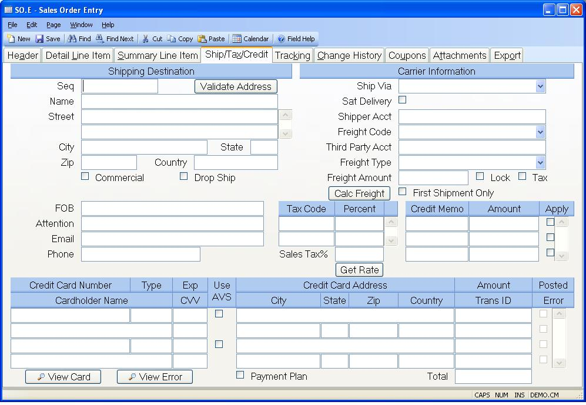

##  Sales Order Entry (SO.E)

<PageHeader />

##  Ship/Tax/Credit

**Ship Seq** This field contains the ship address sequence number. It is originally defaulted from the customer file. If the customer has multiple ship addresses, use the help key to load the correct ship address. Associated sales tax codes will be loaded with the ship address, if they have loaded in the customer entry procedure ( [ CUST.E ](../../../../AR-OVERVIEW/AR-ENTRY/CUST-E/README.md) ).   
  
**Ship Name** Enter the name of the company to which the order will be
shipped.  
  
**Ship address** Enter the address to which this order will be shipped.  
  
**Ship City** Enter the city to which the order will be shipped.  
  
**Ship State** Enter the state to which the order will be shipped.  
  
**Ship Zip** Enter the zip code to which the order will be shipped.  
  
**Ship Country** Enter the country to which the order will be shipped. Please note that you may be required to enter the country name as it has been entered in the [ SHIP.CONTROL ](../../SHIP-CONTROL/README.md) procedure. For example, instead of entering U.S.A. you may need to enter United States. If this requirement has been applied to your account, an error message will be displayed if the entry made into this field does not match the entry found in [ ship.control ](../../../../../../../../rover/AP-OVERVIEW/AP-ENTRY/ACCT-CONTROL/ACCT-CONTROL-1/ar-e/CUST-E/CUST-E-8/ship-control) .   
  
**Validate Address** Click this button to validate the shipping address.  
  
**Commercial Residential** Check this box if the shipment will be sent to a
commercial address.  
  
**Drop Ship** Setting the flag in this field will cause any purchase orders
which are generated directly from the sales order to carry the ship address as
the PO delivery address.  
  
**FOB** Enter the FOB for this shipment.  
  
**Ship Attn** Enter the name of the person on the contact to whose attention
this shipment should be delivered.  
  
**Ship Email** Enter the email address that should be used when notifying the
customer of the shipment.  
  
**Ship Phone** Enter the phone number for this shipping address.  
  
**Ship Via** Enter the method of shipment or carrier to be used when shipping the items on the sales order to the customer. If ship methods have been defined in the [ SHIP.CONTROL ](../../SHIP-CONTROL/README.md) procedure, this entry will be validated.   
  
**Saturday Delivery** Check this box if the order will be delivered on a Saturday. If you do not know until the order is ready to be shipped if it will be delivered on a Saturday, you can update the associated shipper record with this information via [ SHIP.E ](SHIP-E/README.md) , [ SHIP.E2 ](SHIP-E2/README.md) or [ SHIP.E4 ](SHIP-E4/README.md) .   
  
**Shipper Account** If required, enter the shipper's / company's account
number in this field.  
  
**Freight Code** Select one of the following options:  
  
Prepaid - Freight charges on shipments against the sales order are to be
prepaid  
Collect - Frieght charges are to collected from the customer by the freight
carrier  
Freight Free - No freight will be charged to the customer.  
Third Party - Freight charges are to be paid by a third  
  
**Ship Ups Account Number** If a thirdy party will be paying for the freight
charges, enter their account number here. When the sales order is created the
program will attempt to load this number in for you based on the ship via
method. This number will only be passed to the ship record if the freight code
is set to third party.  
  
**Freight Type** This field controls the way in which the data in the freight amount field is interpreted. On new orders the contents of this field are defaulted based on the settings in the [ SHIP.CONTROL ](../../SHIP-CONTROL/README.md) procedure. The possible entries are:   
  
Estimated - The freight amount entered on the order is only an estimate, the amount incurred will be used on the invoice. The amount will be calculated based on the parameters in the [ SHIP.CONTROL ](../../SHIP-CONTROL/README.md) procedure.   
  
Actual - The freight amount entered on the order is the amount that will appear on the invoice, not the amount actually incurred. The amount will be calculated based on the parameters in the [ SHIP.CONTROL ](../../SHIP-CONTROL/README.md) procedure.   
  
TBD - The amount is ignored and the actual freight charges incurred will be
used.  
  
**Freight Amount** Depending on the setting in the Freight Type field the amount entered in this field will represent either an estimate of freight charges or the amount that will actually be charged on the invoice. The amount may be calculated if the parameters are set in [ SHIP.CONTROL ](../../SHIP-CONTROL/README.md) for the freight carrier associated to the Ship Via to access the carrier's rating system. but may be set manually as well.   
  
**Freight Lock** Check this box if the amount entered in the freight amount field is being set manually and is not to be calculated based on the parameters in the [ SHIP.CONTROL ](../../SHIP-CONTROL/README.md) procedure.   
  
**Tax Freight** Check this box if freight charges are taxable.  
  
**Freight First Shipment Only** Check here if the freight type is "Actual" and
the freight amount should only be applied to the first shipment.  
  
**Tax Codes** Enter the sales tax code(s) to be used for this order. These
codes are originally defaulted from the customer file. They are reloaded, if a
different ship address is selected from the customer ship to address list.
They may be changed manually, as required. In addition to entering the tax
code, the TAXABLE box on the "detail line item" tab must be checked for any
line item that should be taxed.  
  
If a resale number is entered on the header tab of SO.E, tax will not be
applied to the line items. However, tax will be applied to the freight if the
freight is flagged as taxable.  
  
**Tax Code Rate** This field contains the tax percent for the associated tax
code.  
  
**Credit Memo** If any available credit memos exist for the customer, they
will be displayed here. If you wish to apply a credit against the sales order
amount, then check the apply box. If a credit card is being charged, then the
amount will be deducted from the credit card amount being charged. When the
shipment is posted the resulting AR record will reflect the credit, and the
credit memo will be closed.  
  
**CM Amount** The open amount for the associated credit memo. If the open
amount will more than offset the sales order amount, then only the amount
needed will be applied to this sales order.  
  
**CM.Chosen** Check this box if you want to apply the associated credit memo
amount to this order.  
  
**Tax rate** This field contains the total of the tax percentages listed. They
may not be changes manually.  
  
**Get Rate** Click this button to recalculate the sales tax rate. This really only has an effect if you are using a sales tax rate service which you've identified in the [ STAX.CONTROL ](STAX-CONTROL/README.md) procedure. This button should be clicked if you have changed the shipping address so that the proper rate will be calculated.   
  
**Creditcard No** If all or part of the payment is being made with a credit
card enter each credit card to be billed. Card numbers that were entered
previously will only show the last four digits of the card number for security
purposes.  
  
**Creditcard Type** Displays the type of the associated credit card. This
field is updated automatically based on the credit card number entered and may
not be changed.  
  
**Cardholder Name** Enter the name of the person that appears on the credit
card.  
  
**Creditcard Exp** Enter the expiration month and year for the credit card in
the format mmyy. For example, March of 2006 would be entered as 0306.  
  
**Creditcard Cvv** If available you may enter the 3 or 4 digit card
verification value usually found on the back side of the credit card. This
provides an additional level of security and typically a lower transaction
cost from your credit card service. Codes that were entered previously will
appear as "***" to prevent other users from seeing this information.  
  
**Creditcard Avs** If this box is checked the customer address will be
verified against the credit card. This provides an additional level of
security and can reduce the charges for the transaction from the credit card
service.  
  
**Credit Card Address** If the associated AVS box is checked the street
address in this field will be used for address verification. If the credit
card was loaded from the customer master record the address will also be
loaded from there. Otherwise, the address is loaded from the ship address.
Note: Only the first line of the street address (i.e. 123 Main Street) should
be entered into this field. Do not include the city, state or country.  
  
**Credit Card City** Enter the billing city for the associated credit card.  
  
**Credit Card State** Enter the billing state for the associated credit card.  
  
**Credit Card Zip** If the associated AVS box is checked the zip code in this
field will be used for address verification. If the credit card was loaded
from the customer master record the zip code will also be loaded from there.
Otherwise, the zip code is loaded from the ship address zip code.  
  
**Credit Card Country** Enter the billing country for the associated credit
card.  
  
**Creditcard Amt** Enter the amount to be charged to each credit card.  
  
**Creditcard Tran** Displays the credit card transaction number issued by the
credit card processing company for the associated credit card.  
  
**Creditcard Post** A check mark in this box indicates that the amount on the
associated credit card has already been billed and may not be changed. This is
set automatically by the system during shipment processing.  
  
**Credit Card Error** If this box is checked the associated transaction was
authorized successfully but there were warnings messages issued with the
transaction.  
  
**Creditcard Total** Displays the total of all the credit card amounts
entered.  
  
**View Card** If you are authorized to view credit card numbers you may see
the entire credit card number by placing the cursor on the credit card number
field and clicking this button.  
  
**View Error** If the Error check box is checked for a transaction you may
view the error message by placing the cursor in the credit card number field
of the associated transaction and clicking this button.  
  
**Calc Freight** Press this button to recalculate the freight. This only applies if the parameters are set in [ SHIP.CONTROL ](../../SHIP-CONTROL/README.md) for the freight carrier associated to the Ship Via to access the carrier's rating system.   
  
**Payment Plan** Check this box if the amounts entered for the credit cards
represent a partial payment of the total order and that the balance will be
paid through the invoice. This prevents the shipping process from attempting
to charge the remaining balance to the credit cards.  
  
**Prepay** Check this box if the credit card is to be charged immediately
rather than just preauthorized. This will result in an on account entry being
made in the accounts receivable file which will be referenced in the credit
memo field of the sales order. The invoice that results from the shipment
against the sales order will show the credit card amount entered as paid.  
  
  
<badge text= "Version 8.10.57" vertical="middle" />

<PageFooter />