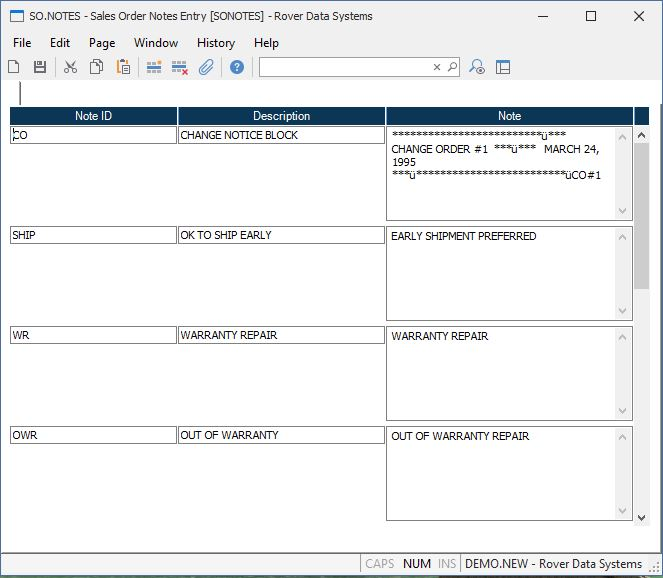

##  Sales Order Notes Entry (SO.NOTES)

<PageHeader />

##

**Control.ID** The ID to the notes record is controlled by the system and is
automatically entered as "SO.NOTES".  
  
**ID** Enter the identification you want to use for the associated note. You
may enter the ID as a name descriptive of it's use, or simply use a number or
letter.  
  
**Description** Enter a brief description of the contents of the associated
note. The description will be appear in the selection window for the available
notes to assist the user in selecting the proper note.  
  
**Note** Enter the actual text of the note which will be loaded into the sales
order when the associated note ID is selected.  
  
  
<badge text= "Version 8.10.57" vertical="middle" />

<PageFooter />