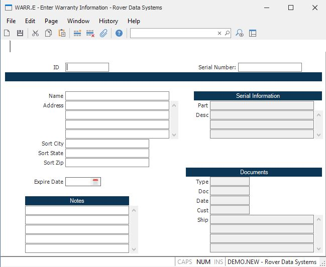

##  Enter Warranty Information (WARR.E)

<PageHeader />

##

**ID** Enter the warranty registration number. If you leave this field null, a
sequential number will be assigned.  
  
**Serial** Enter the serial number for the part under warranty. The
information will be displayed from the serial file for reference.  
  
**Name** Enter the name of the end user. Normally, this will be the person, or
company, which sent in the warranty card.  
  
**Address** Enter the address of the end user. This is a free form field.
However, it is recommended that the last line be the city, state and zip code.
The system will attempt to parse this data and place it into the sort fields.  
  
**Sort.City** The city in which the warranteed part is located.  
  
**Sort State** The state in which the warranteed part is located.  
  
**Sort.Zip** The zip code of the customer/user. This field is originally
loaded from the address field, but may be manually entered or changed as
required.  
  
**Expire Date** The date on which the warranty will expire.  
  
**Notes** Enter any notes you wish.  
  
**Part Number** The part number, as read from the serial file.  
  
**Part Description** The description of the part, as read from the parts
master file.  
  
**Doc Type** The type of document which originally updated the serial file.  
  
**Doc Number** The number of the document which originally updated the serial
file (e.g. shipment number).  
  
**Doc Date** The date of the associated document.  
  
**Customer** The customer number on the original document. This will normally
be the dealer or distributor to which the part was originally shipped.  
  
**Ship Address** The original ship address on the associated document.  
  
  
<badge text= "Version 8.10.57" vertical="middle" />

<PageFooter />