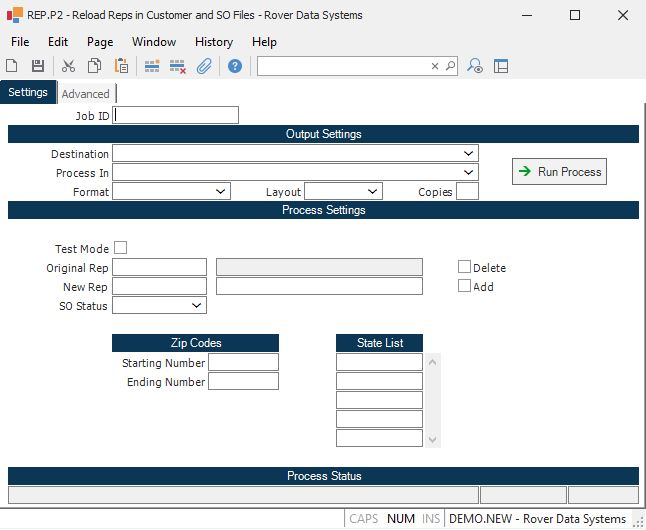

##  Reload Reps in Customer and SO Files (REP.P2)

<PageHeader />

##

**Job ID** Enter a unique ID if you wish to enter and save the parameters to
this procedure for future use. If you only need to run the procedure and do
not want to save your entry then you may leave this field empty.  
  
**Destination** Select the destination for the output from this procedure.  
  
**Process** Select the method to be used for processing the report. Foreground
is always available and must be used when output is directed to anything other
than a system printer (i.e. printers spooled through the database on the host
computer.) Depending on your setup there may be various batch process queues
available in the list that allow you to submit the job for processing in the
background or at a predefined time such as overnight. A system printer must be
specified when using these queues.  
  
**Format** Select the format for the output. The availability of other formats
depends on what is allowed by each procedure. Possible formats include Text,
Excel, Word, PDF, HTML, Comma delimited and Tab delimited.  
  
**Layout** You may indicate the layout of the printed page by specifying the
appropriate setting in this field. Set the value to Portrait if the page is to
be oriented with the shorter dimension (usually 8.5 inches) at the top or
Landscape if the longer dimension (usually 11 inches) is to be at the top.
Portrait will always be available but Landscape is dependent on the output
destination and may not be available in all cases.  
  
**Copies** Enter the number of copies to be printed.  
  
**Run Process** Click on the button to run the process. This performs the save
function which may also be activated by clicking the save button in the tool
bar or pressing the F9 key or Ctrl+S.  
  
**Last Status Message** Contains the last status message generated by the
program.  
  
**Last Status Date** The date on which the last status message was generated.  
  
**Last Status Time** The time at which the last status message was generated.  
  
**Test Mode** Check this box if you wish to view the results before updating
the files.  
  
**Original Rep** Enter the rep you want to replace on the customer and/or open
sales order records. The files that will be updated are the CUST and SO files.
The only SO records that can be updated are open sales orders.  
  
**Rep Name** The name of the rep.  
  
**Delete Rep?** Check this box if you wish to delete this rep from the
customer and/or sales order records and not replace with a new rep. If this
box is checked, you do not have to enter a new rep id.  
  
**New Rep** Enter the rep id that you want to replace the original rep id
with. Please note that if the customer and/or sales order records contain more
than one rep id, the only rep to be replaced is the rep id that is referenced
in the original rep field.  
  
**Rep Name** The name of the rep.  
  
**Add?** Check this box if you wish to add a new rep to the customer and/or
open sales order records. If this box is checked, an original rep should not
be referenced in this procedure. When adding a rep, a zip code range or state
list must be entered in order to detemine which customer numbers to update. If
this option is selected, the order percent will be set to 100 on both the
customer and SO records.  
  
**So Status** Select the status of orders you wish to update.  
  
1\. New - New orders only. Those with a status of "N" or "NEW".  
2\. Backordered - Orders with a status of "B" or "BACKORDER"  
3\. New & Backordered.  
4\. All Open Orders. This selection will include closed orders IF there is a
pending shipment against the order. It will, also, include new and backordered
sales orders. This update will only be made against the SO file. All other
related files such as the SALES file and AR file will not be updated.  
  
If you do not wish to update the SO file, leave this field blank.  
  
**Starting Zip Code** You have the option to limit the customers that will be
selected in this procedure by zip code. If you wish to use this function, both
a starting and ending zip code will be required. Enter the starting zip code
here. Only enter the first 5 numbers of the zip code. This option is helpful
if you only wish to update the reps for certain territories.  
  
**Ending Zip Code** You have the option to limit the customers that will be
selected in this procedure by zip code. If you wish to use this function, both
a starting and ending zip code will be required. Enter the ending zip code
here. Only enter the first 5 numbers of the zip code. This option is helpful
if you only wish to update the reps for certain territories.  
  
**State List** If you wish to update the rep for customers with certain states, enter those states here. Please note that in order for the update to occur the state that is entered here must match exactly the state that is entered on the general tab in [ CUST.E ](../../../../../rover/AP-OVERVIEW/AP-ENTRY/ACCT-CONTROL/ACCT-CONTROL-1/ar-e/CUST-E) . For example, if you enter CA here and CALIF in [ CUST.E ](../../../../../rover/AP-OVERVIEW/AP-ENTRY/ACCT-CONTROL/ACCT-CONTROL-1/ar-e/CUST-E) , the rep will not be updated.   
  
  
<badge text= "Version 8.10.57" vertical="middle" />

<PageFooter />