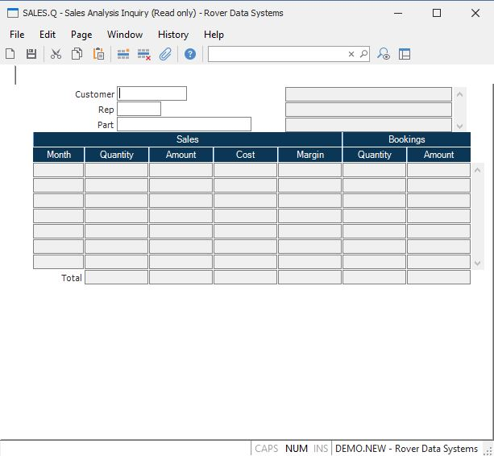

##  Sales Analysis Inquiry (SALES.Q)

<PageHeader />

##

**Rec.ID** This field is not prompted in the SALES.Q screen.  
  
**Customer** If you wish to see sales analysis for a selected customer, enter
that customer number here.  
  
**Rep** If you wish to see sales analysis on a sales rep, enter that rep
number here. If you have entered a customer number in the previous field, this
field will be skipped.  
  
**Part** If you wish to see sales analysis on a part, enter that part number
here. If you have entered either a customer number or a rep number in the
previous fields, this field will be skipped.  
  
**Month** The month and year for the information on the associated line.  
  
**Qty** The quantity sold in the month identified.  
  
**Sales** The total sales dollars in the month identified.  
  
**Cost** The total extended cost for the quantity sold.  
  
**Profit** The profit amount for the identified month. This figure is the
sales amount less the cost.  
  
**Book.Qty** The total qty booked in the month identifed.  
  
**Book.Amt** The total extended value of the booked orders in the month.  
  
**Total.Qty** The total of all quantities shown.  
  
**Total.Sales** The total of all sales shown.  
  
**Total.Cost** The total of all costs shown.  
  
**Total.Profit** The total profit made during the year. This is the total
sales less the total cost.  
  
**Total.Book.Qty** The total of all book quantities shown.  
  
**Total.Book.Amt** The total of all book amounts shown.  
  
**Name/Desc** The name of the customer / rep or the description of the part
number entered, depending upon the selection made.  
  
**Sales Chart** Displays a bar chart showing the sales amount, cost and margin
for the data displayed.  
  
  
<badge text= "Version 8.10.57" vertical="middle" />

<PageFooter />