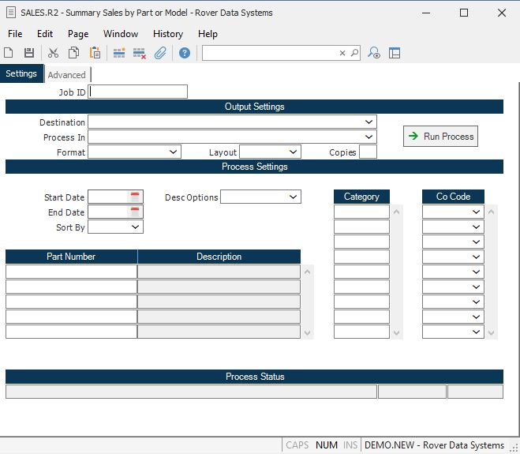

##  Sales by Part or Model (SALES.R1)

<PageHeader />

##

**Job ID** Enter a unique ID if you wish to enter and save the parameters to
this procedure for future use. If you only need to run the procedure and do
not want to save your entry then you may leave this field empty.  
  
**Destination** Select the destination for the output from this procedure.  
  
**Process** Select the method to be used for processing the report. Foreground
is always available and must be used when output is directed to anything other
than a system printer (i.e. printers spooled through the database on the host
computer.) Depending on your setup there may be various batch process queues
available in the list that allow you to submit the job for processing in the
background or at a predefined time such as overnight. A system printer must be
specified when using these queues.  
  
**Format** Select the format for the output. The availability of other formats
depends on what is allowed by each procedure. Possible formats include Text,
Excel, Word, PDF, HTML, Comma delimited and Tab delimited.  
  
**Layout** You may indicate the layout of the printed page by specifying the
appropriate setting in this field. Set the value to Portrait if the page is to
be oriented with the shorter dimension (usually 8.5 inches) at the top or
Landscape if the longer dimension (usually 11 inches) is to be at the top.
Portrait will always be available but Landscape is dependent on the output
destination and may not be available in all cases.  
  
**Copies** Enter the number of copies to be printed.  
  
**Run Process** Click on the button to run the process. This performs the save
function which may also be activated by clicking the save button in the tool
bar or pressing the F9 key or Ctrl+S.  
  
**Start Date** Enter the range start date within which the shipment date must
fall to be selected for this report.  
  
**End Date** Enter the end range date within which the shipment date must fall
to be selected for this report.  
  
**Sort by P)art or M)odel** This field defines the order in which the items
will be listed. Enter the letter "C" for category, "P" for part or "M" for
model. If no entry is made in this field, the report will sort by part number.  
  
**Co Code** Enter the company codes you wish to appear on this report. If left
blank all company codes will be included.  
  
**Order Types** If you wish to run this report for specific sales order types, enter the type codes in this field. These type codes would have originally been entered on the order in [ SO.E ](../../../../../rover/AP-OVERVIEW/AP-ENTRY/AP-E/AP-E-1/CURRENCY-CONTROL/SO-E) .   
  
**Category** Enter the category codes you wish to run the report for. If no
entry is made in this field, all categories will be included.  
  
**Part Number** If you wish to run this report for specific part numbers,
enter the part numbers in this field.  
  
**Part Description** This field contains the first line of the part
description.  
  
**Customer** If you wish to limit this report to specific customers, enter the
customer numbers in this field.  
  
**Customer Name** This field contians the customer name.  
  
**Last Status Message** Contains the last status message generated by the
program.  
  
**Last Status Date** The date on which the last status message was generated.  
  
**Last Status Time** The time at which the last status message was generated.  
  
  
<badge text= "Version 8.10.57" vertical="middle" />

<PageFooter />