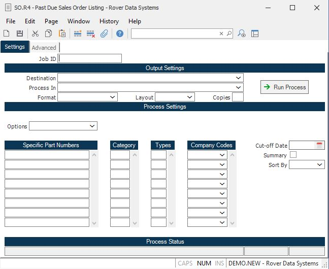

##  Past Due Sales Order Listing (SO.R4)

<PageHeader />

##

**Job ID** Enter a unique ID if you wish to enter and save the parameters to
this procedure for future use. If you only need to run the procedure and do
not want to save your entry then you may leave this field empty.  
  
**Destination** Select the destination for the output from this procedure.  
  
**Process** Select the method to be used for processing the report. Foreground
is always available and must be used when output is directed to anything other
than a system printer (i.e. printers spooled through the database on the host
computer.) Depending on your setup there may be various batch process queues
available in the list that allow you to submit the job for processing in the
background or at a predefined time such as overnight. A system printer must be
specified when using these queues.  
  
**Format** Select the format for the output. The availability of other formats
depends on what is allowed by each procedure. Possible formats include Text,
Excel, Word, PDF, HTML, Comma delimited and Tab delimited.  
  
**Layout** You may indicate the layout of the printed page by specifying the
appropriate setting in this field. Set the value to Portrait if the page is to
be oriented with the shorter dimension (usually 8.5 inches) at the top or
Landscape if the longer dimension (usually 11 inches) is to be at the top.
Portrait will always be available but Landscape is dependent on the output
destination and may not be available in all cases.  
  
**Copies** Enter the number of copies to be printed.  
  
**Run Process** Click on the button to run the process. This performs the save
function which may also be activated by clicking the save button in the tool
bar or pressing the F9 key or Ctrl+S.  
  
**Part Numbers to Print** Enter all of the part numbers you want to have
included in the listing or leave this field blank to include all part numbers
in part number order. To list items without a part number enter the word "NON-
INVENTORY". If part numbers are entered, do not enter category below.  
  
**Category** You may limit the items listed on the report to include only
those items which are part of the categories you enter in this field. Leave
this field blank to list all items. If part numbers are entered above, then
categories should not be entered.  
  
**Cut-off Date** Enter the date to be used in determining when an item is past
due. All open items due on a date less than or equal to the date entered will
be included in the listing.  
  
**Summary** Check this box if you want a summary version of the report, that
will print one line for each part number summarizing the past due quantity and
dollars for the part.  
  
**Sort by Part or Model** This field defines the order in which the items will
be listed. Enter the letter "P" for part or "M" for model.  
  
**Type Codes** You may restrict the items included on the report to the sales
order type codes you enter in this field. Leave the field blank to include all
types.  
  
**Co Code** Enter the company codes you wish to appear on this report. If left
blank all company codes will be included.  
  
**Last Status Message** Contains the last status message generated by the
program.  
  
**Last Status Date** The date on which the last status message was generated.  
  
**Last Status Time** The time at which the last status message was generated.  
  
  
<badge text= "Version 8.10.57" vertical="middle" />

<PageFooter />