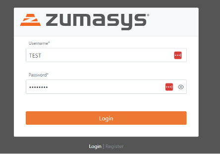
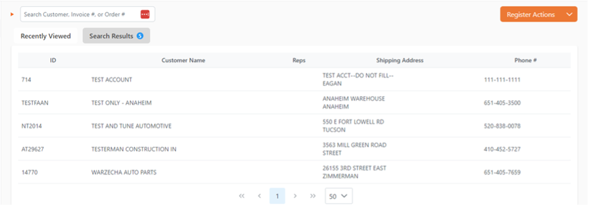
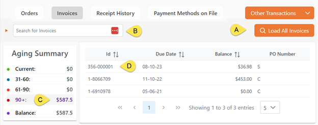
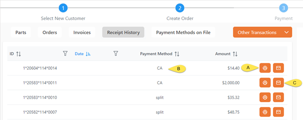
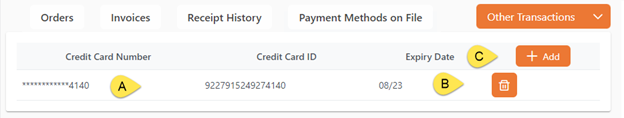
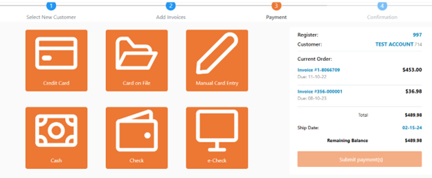
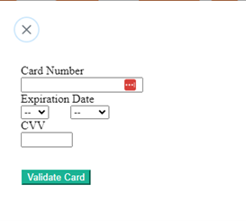
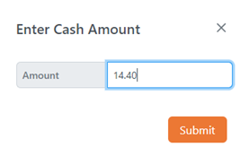
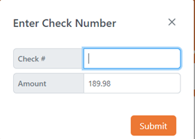
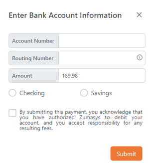

# Rover POS Overview

<PageHeader />

Rover POS allows your business users to originate orders, fulfill orders, process payments and more. Depending on your needs, configure the application to allow your users to perform any combination of those tasks in an easy-to-follow web interface. Whether you are using Rover ERP, Smart Suite, IMACS or any number of other back-end systems this modern interface can be made available to your users! The documentation that follows seeks to cover all standard functionality of the product, and your experience may vary further depending on your configuration and customization.

> NOTE: Please note that while you may use this version in tandem with [Smart Suite POS](../../smartsuite/pos/README.md), closing the register in one application will result in the register being closed for the other application.

## Logging in

Log to the URL that has been provided for you and then enter your Username and Password

## Starting Register

Once you log in, you will be prompted to enter in the starting cash for your Register.

## POS Screen Options

When in the POS screen the screen options are as follows:

1)	This button toggles the side bar descriptions ON and OFF, normally you will just use the POS option, the dashboard option will be populated based off of your role in the company.
2)	This is where you will scan/type in the Invoice barcode or enter in a customer name to search for the customers. You can also look up an Order # if you need to finalize an order before using the invoice.
3)	The Recently Viewed options will show and keep track of the most recent customers that have been processed, this is for quick access if you have a frequent customer.
4)	If you have searched for a customer, the search results tab is where you will see the results of the search.
5)	Register Actions is where you will select to do some additional register functions.

	a.	Close Register.
	b.	Add additional cash to the register drawer.
	c.	Withdraw cash from the register drawer.
	d.	Perform a NO SALE transaction where you can just open the cash drawer.
6)	This shows the currently logged on user, your options here are:

	a.	Logout
	b.	Settings – the options in here will vary depending on your user security options.
7)	The “X” in the Recently Viewed results is where you can remove a recent customer if you do not wish them to appear in the recent shout cuts.
8)	Load Customers will display all customers and allow you to scroll through them.
9)	If you create and order and ‘Save’ the order to complete later, this is where you will find the draft saved order. 

## Processing an Invoice

After scanning an invoice into the search field, the customer associated with the invoice will be loaded and the invoice will be loaded to the transaction. 

1)	Customer that is associated with the invoice.
2)	Invoice number and the amount due for this invoice.
3)	Select the “Continue to Payment” to proceed to the payment options. 

## Processing a Transaction

### Customer Lookup

To lookup a customer, enter in 3 or more letters in the customer’s name and the search results tab will highlight and display the number of accounts that match your lookup.

You will select the customer you are looking for or click in the search field and enter a new search.

After you have selected a customer, there are several actions you can view or select from

1)	Parts – *Parts Tab is only available if you have the ROVER parts module.
Here you can search for parts to add to the order, you will enter your part number or part of the description in the ‘Search for Parts’ field, once displayed you will select the part and quantity to add to the order.

2)	Orders – this is where you can view all of the open orders for this customer, you can select from the list to finalize an order if needed. 

a.	You can select the “Load All Orders” label ‘A’ to load and view all orders that need to be finalized. If payment is required when you finalize an order, you will be taken directly to the payment screen.
b.	In the search field you can scan/enter an order to see a single order

3)	Invoices – If you select the Invoice tab,

a.	Load All Order will change to be “Load All Invoices”. Selecting this will display all open invoices regardless of age.
b.	Search field will allow you to search for a single invoice.
c.	Aging Summary will display the customers aging, selecting one of the aging categories, Current, 31-60, 61-90, 90+, will display all the invoices in that aging category.
d.	This is where the invoices will be displayed, from here you can click on 1 or more of the displayed invoices add them to the current register transaction. After selecting the invoices, you will then click on ‘Continue to Payment” to select the payment option.

4)	Receipt History – Selecting this option will display the selected customers’ receipts.

If there is a receipt from the current day, there will be an option to ‘Post Void’ the transaction.  This Icon will be immediately to the left of the print icon.

a.	Clicking on the print option to the right of the transaction information will reprint the receipt for that transaction.
b.	This will display the Tender/Payment type that was used, the “split” shows there were multiple payment types used.
c.	Clicking here will email a copy of the receipt to the email address that you enter.

5)	Payment Methods on File – this is where you can view or add Card On File “COF” options for a customer. A customer can have multiple cards on file.

a.	Displays the current saved payment methods that a customer has on file. The Credit Card ID is the token that was received from the card processor, this is NOT the actual credit card number.
b.	Select the Trash Can to delete a card on file, this can not be undone, if a COF is deleted then you will need to get the information again and Add a COF  again.
c.	Select the “Add” button to create a new ‘Card On File’.

i.	In this section you will enter the credit card information, this section is a secure ‘I-Frame’ from the credit card processor, data entered here is not entered in to the POS software. Fill out the fields and then select the “Validate Card”.
ii.	After getting the credit card validated, enter in the customer’s name and billing information. Once the fields are entered then select the Save button. If the card is validated and the address information is all correct then the new card will be added to the COF display above.

6)	Other Transactions – Here you can select to
	a.	Receive Cash on Account – After selecting this option you will be prompted to add a ‘Note’ and then the amount to add. After entering this information, you will be taken directly to the Payment options. No other options are available with this type of transaction.
	b.	Receive Other Income - After selecting this option you will be prompted to add a ‘Note’ and then the amount to add. After entering this information, you will be taken directly to the Payment options. No other options are available with this type of transaction.

## Tender Options

When completing a transaction, after selecting the ‘Continue to Payment’ or if you did one of the ‘Other Transactions” options that took you straight to the payment page. Here you will select one of the payment types, you may use more than one payment type in a transaction

•	Credit Card – This option will trigger the credit card device associated to the register number to turn on and prompt the cashier to insert the card and validate the tender amount.

•	Card on File – When selecting this option if there is only one card on file then you will be prompted to enter the amount of the transaction to charge to the card. If there are multiple cards on file then you will be prompted to select the card to use and also enter the amount to charge to the card.

•	Manual Card Entry – will open an I-Frame (this is a secure window to the card processor) and prompt you to manually enter the card information.

•	Cash – Selecting this method will prompt you to enter the cash amount to use, the default will be any remaining amount owed.

•	Check – Select the check option, you will be prompted to enter the check number and the amount to submit with this tender type.

•	e-Check – Select the e-Check to enter you bank account information to have a your account debited, you will enter in the “Account Number”, “Routing Number”, “Amount” to debit, and then select if this is a Checking or Savings account and then select the approval box to authorize the payment option

 

<PageFooter />
