# Rover POS Overview

<PageHeader />

A new version of Rover is here! Rover POS allows you to interact with Rover in a POS environment through our new web client. Make sales and move inventory between different customers through an easy-to-follow web interface.

## Overview

Depending on your licensed modules and security levels, the modules available to you may differ as seen in the screenshot below.

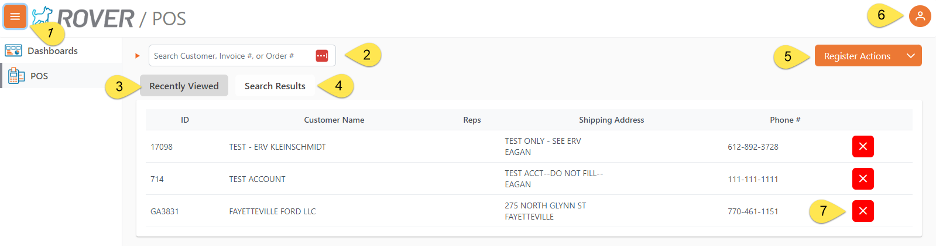

1. This button toggles the sidebar descriptions ON and OFF. Normally you will use the POS option, which will be populated based on your security settings.
2. This is where you will scan/type in the invoice barcode or enter a customer name to search for customers. You can also look up an order # if you need to finalize an order before using the invoice.
3. The Recently Viewed options will show and keep track of the most recent customers that have been processed, this is for quick access if you have a frequent customer.
4. The search results tab is where you will see the results of a search.
5. Register Actions is where you will select some additional register functions.
 a.	Close Register.
 b.	Add additional cash to the register drawer.
 c.	Withdraw cash from the register drawer.
 d.	Perform a NO SALE transaction, where you can open the cash drawer.
6. This shows the currently logged-on user, your options here are:
 a.	Logout
 b.	Settings – the options in here will vary depending on your user security options.
7. The “X” in the Recently Viewed results is where you can remove a recent customer if you do not wish them to appear in the recent shout cuts.

## Getting Started

We can start the Rover POS process by selecting POS on the leftmost menu. It will open up a new screen that will allow you to select the customer you wish to sell to. You can search for the desired customer using either their Name or ID, you can also scan/enter in an invoice # or order #. 

*If using the ROVER database, the customers that are listed here are directly linked to CUST.E in Rover. Once a new customer is added to that Rover module, you can quickly find them listed in Rover POS.

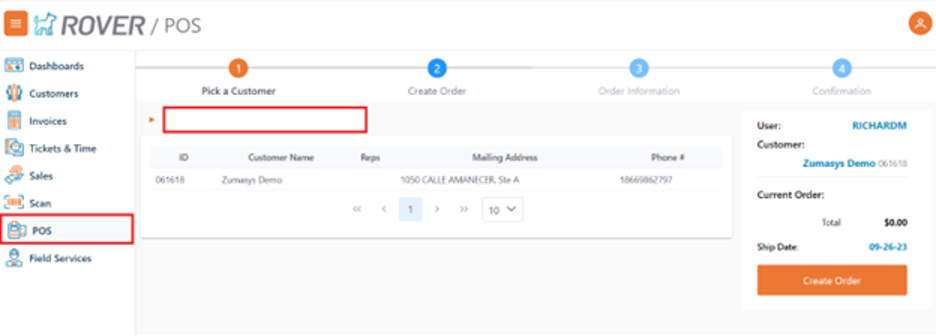

## Customer Lookup

To lookup a customer, enter in 3 or more letters in the customer’s name and the search results tab will highlight and display the number of accounts that match your lookup.

You will select the customer you are looking for or click in the search field and enter a new search.

## Create Your Order

After we have selected our customer, a new screen will open showing a few different options. 

## Parts
*Parts Tab is only available if you have the ROVER parts module.

Search for part numbers and names using multiple filters. Use this to create and prepare orders. It will initially open on the code price and will list all parts in alphabetical order. By selecting the different filters, we can narrow down the search to specific parts. Alternatively, we can also search for our desired part by using either the description of the part or the part number. Clicking “RESET SEARCH” will clear all filters and keywords, returning us to the alphabetical code price list. It will display the price along with the quantity you want to add to your cart. Click “Add to Cart” and we can then click “Create Order” to continue with this sales order.

*If you find that the quantity or price is incorrect, you will be able to change either of those by clicking on the part name on the right after adding it to your cart.

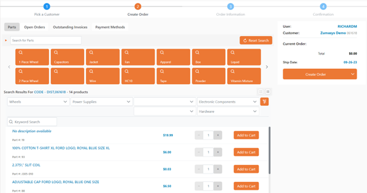

### 1) Orders
Displays all open orders along with their ID’s, Reps, Type, Order Date, Purchase Order #, and buttons to allow you to download or email the receipt. 
Finalizing an order that has a payment required will automatically load the payment screen with the newly created Invoice.

*If you are using the ROVER database, this information gets pulled after a sales order has been created in SO.E.

### 2) Invoices

Lists all outstanding invoices. 
*If you are using the ROVER database, this information gets pulled from AP.E.

A. “Load All Invoices”. Selecting this will display all open invoices regardless of age.

B. Search field will allow you to search for a single invoice.

C. Aging Summary will display the customers aging, selecting one of the aging categories, Curren, 32-60, 61-90, 90+, will display all the invoices in that aging category.

D. This is where the invoices will be displayed, from here you can click on 1 or more of the displayed invoices and add them to the current register transaction. 
Once an invoice has been added to the current transactions, you can click on the Invoice # and you will be allowed to edit the amount payed on that invoice.

After selecting the invoices to include for payment, you will then click “Continue to Payment” to select the payment option.

### 3) Receipt History

Selecting this option will show all the selected customer’s receipts.

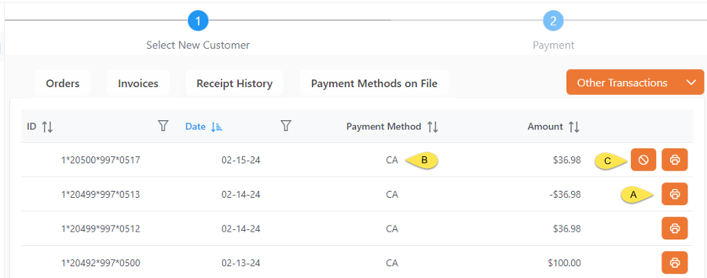

A. Clicking on the print option to the right of the transaction information will reprint the receipt for that transaction.  

B. This will display the Tender/Payment type that was used, the “split” shows there were multiple payment types used.

C. If the transaction is from the current day, you will have the option to void the transaction, you will then be prompted to confirm “Yes”, or “No” if you wish to continue.

### 4) Payment Methods on File

This is where you can view or add a saved payment option for a customer. A customer can have multiple forms of payment on file.

A. Displays the current saved payment methods that a customer has on file. The Credit Card ID is the token that was received from the card processor, this is NOT the actual credit card number.

B. Select the trash can to delete a card on file, this cannot be undone, if a saved payment is deleted you will need to renter it again.

C. Select the “Add” button to create a new ‘Card on File’.

i.	In this section you will enter the credit card information, this section is a secure ‘I-Frame’ from the credit card processor, data entered here is not entered into the POS software. Fill out the fields and then select the “Validate Card”.

ii.	After getting the credit card validated, enter in the customer’s name and billing information. Once the fields are entered then select the Save button. If the card is validated and the address information is all correct, then the new card will be added to the COF display above

### 5) Other Transactions

Here you can select to:

A) Receive Cash on Account – After selecting this option you will be prompted to add a ‘Note’ and then the amount to add. After entering this information, you will be taken directly to the Payment options. No other options are available with this type of transaction.

B) Receive Other Income - After selecting this option you will be prompted to add a ‘Note’ and then the amount to add. After entering this information, you will be taken directly to the Payment options. No other options are available with this type of transaction.

## Order Information

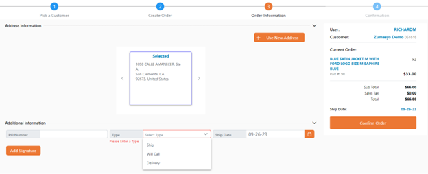
 
On the order information screen, you will be presented with the Address Information list. The addresses are automatically pulled from the entries that already exist in CUST.E from the Rover client. Pressing the “Use New Address” button will create a new address in CUST.E once the new address has been saved.

The Additional Information section allows for a parts order number, type of shipping, and ship date. The type of shipping is determined by MRK.CONTROL so more can be added. There is also the option of a signature that can be added to the receipt.

Confirm that the order information on the right of the page is correct then hit “Confirm Order”. Any kind of delivery costs, taxes, and other fees will be calculated there and displayed with a total.
 
## Tender Options

When completing a transaction, after selecting the ‘Continue to Payment’ or if you did one of the ‘Other Transactions” options that took you straight to the payment page. Here you will select one of the payment types, you may use more than one payment type in a transaction.

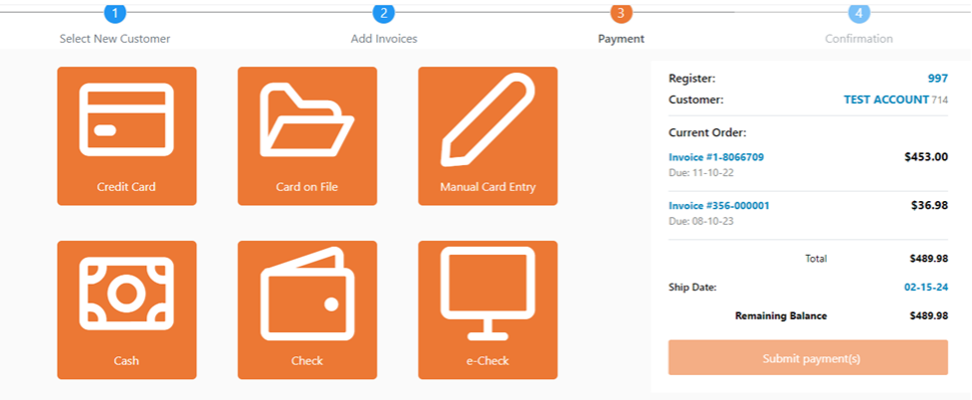

·	Credit Card – This option will trigger the credit card device associated to the register number to turn on and prompt the cashier to insert the card and validate the tender amount.
 
·	Card on File – When selecting this option if there is only one card on file then you will be prompted to enter the amount of the transaction to charge to the card. If there are multiple cards on file, you will be prompted to select the card to use and enter the amount to charge it.

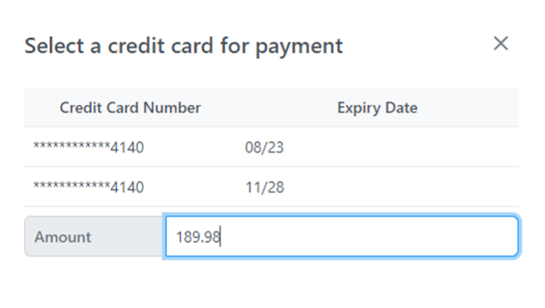

·	Manual Card Entry – this will open an I-Frame (this is a secure window to the card processor) and prompt you to manually enter the card information.

·	Cash – Selecting this method will prompt you to enter the cash amount to use, the default will be any remaining amount owed.

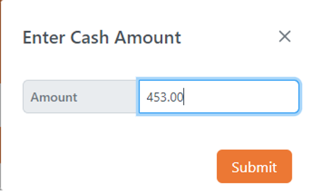

If you tender an amount greater than the balance due, you will have the option to “Apply Overage to Account”, select the check box to apply or uncheck to receive change back.

If the customer is receiving the change, the amount due to the customer will be displayed below the receipt options.

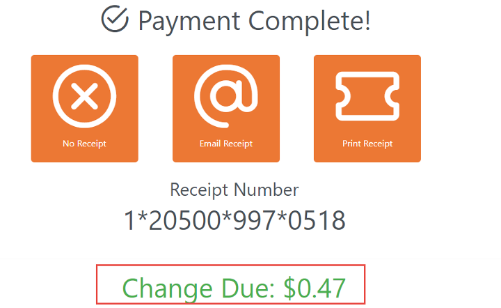

·	Check – Select the check option, you will be prompted to enter the check number and the amount to submit with this tender type.

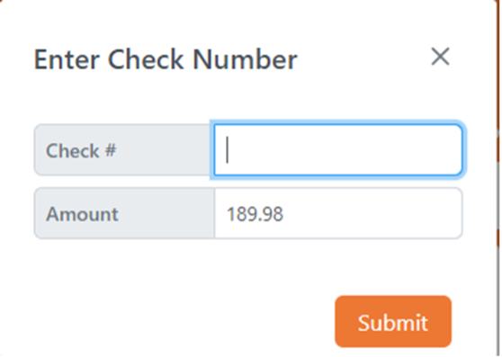

·	e-Check – Select the e-Check to enter your bank account information to have your account debited, you will enter the “Account Number”, “Routing Number”, and “Amount” to debit, and then select if this is a Checking or Savings account and then select the approval box to authorize the payment option

## Order Completion

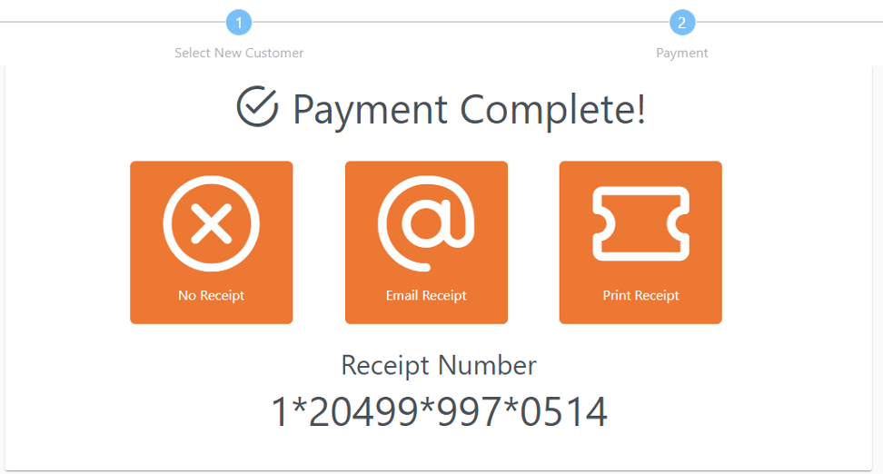

Here you will select your receipt option: print it, email it or No Receipt.

The Sales Order has now been created. Customers equipped with Rover Pay can continue to the payment of the order.
 

<PageFooter />
