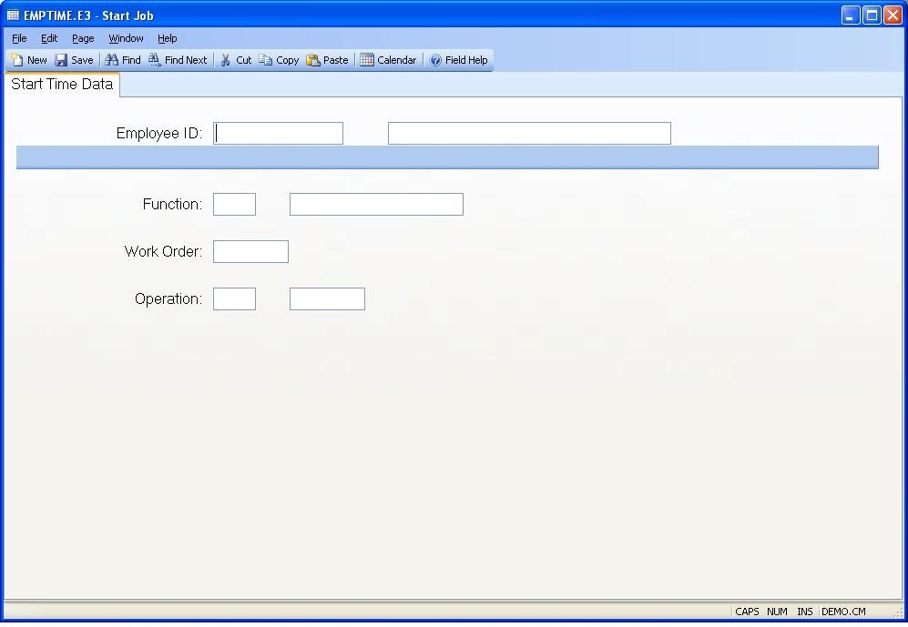

##  Start Job (EMPTIME.E3)

<PageHeader />

##  Start Time Data

**Employee ID** Enter the identification of the employee whose start time is
to be posted.  
  
**Function** Enter the function to be used for the transaction. The function
defines the type of worked performed such as "Production" or "Rework" etc.  
  
**Work Order** Enter the number of the work order that the time will be posted
against.  
  
**Operation** Enter the number which identifies the operation in the routing
at which the time will be charged.  
  
**Employee Name** Contains the name of the employee identified by the employee
number entered. The name displayed is for information only and may not be
changed.  
  
**Function Description** Displays the description from the [ LABOR.CONTROL ](../../LABOR-CONTROL/README.md) record for the labor function entered.   
  
**Work Center** Displays the work center associated with the operation to be
charged with the time.  
  
  
<badge text= "Version 8.10.57" vertical="middle" />

<PageFooter />