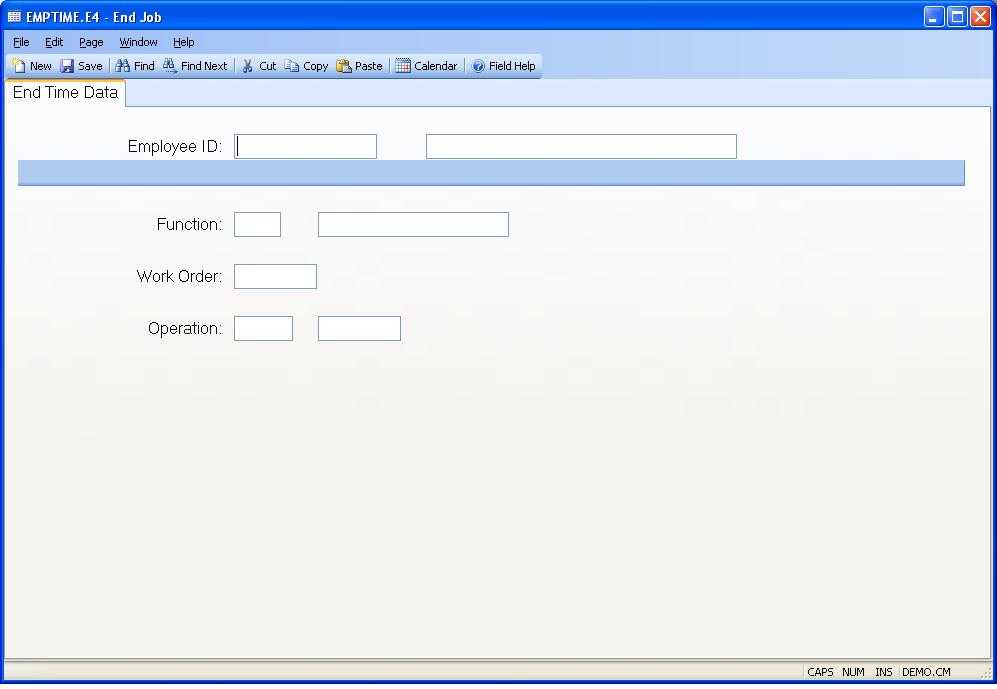

##  End Job (EMPTIME.E4)

<PageHeader />

##  End Time Data

**Employee ID** Enter the identification of the employee whose start time is
to be posted.  
  
**Function** Enter the job function that is to be ended. If you are logged
into only one job this information will be loaded for you.  
  
**Work Order** Enter the number of the work order that you are stopping work
on. If you are logged into only one job this information will be loaded for
you.  
  
**Operation** Enter the operation number of the work order that you are
stopping work on. If you are logged into only one operation on the job, this
information will be loaded for you.  
  
**Employee Name** Contains the name of the employee identified by the employee
number entered. The name displayed is for information only and may not be
changed.  
  
**Function Description** Displays the description from the [ LABOR.CONTROL ](../../LABOR-CONTROL/README.md) record for the labor function entered.   
  
**Work Center** Displays the work center associated with the operation to be
charged with the time.  
  
  
<badge text= "Version 8.10.57" vertical="middle" />

<PageFooter />