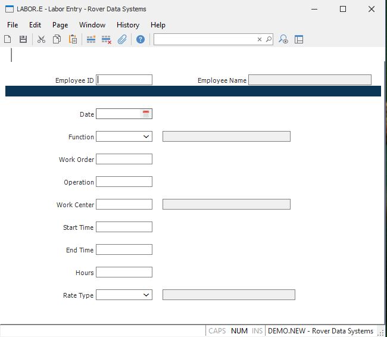

##  Labor Entry (LABOR.E)

<PageHeader />

##

**Labor ID** The labor ID does not appear on the screen. A sequential number
is assigned by the system when the transaction is filed.  
  
**Employee ID** Enter the identification of the employee whose labor is to be
posted. The employee ID is checked against the entries in the employee file.  
  
**Employee Name** Contains the name of the employee identified by the employee
number entered. The name displayed is for information only and may not be
changed.  
  
**Date** Enter the date on which the labor being posted was incurred. The
system will default the current date.  
  
**Function** Enter the function to be used for the transaction. The function
defines the type of worked performed such as "Production" or "Rework" etc.  
  
**Work Order** Enter the number of the work order that incurred the labor cost
to be entered in the transaction.  
  
**Operation** Enter the number which identifies the operation in the routing
at which the labor is to be charged. If you know the work center but not the
operation you may skip this field and enter the work center at the next
prompt. The system will load this field with the operation associated with the
first occurrence of the work center in the routing.  
  
**Work Center** Enter the work center to be charged with the labor hours in
the transaction. If an operation was entered in the previous prompt then the
data will already be present. If you left the previous prompt blank then you
must enter the work center. The operation will be determined by the system. It
is important to understand that the same work center may appear more than once
in the routing and that the system will assume the operation you want is the
first occurrence of the work center within the routing. If this is not the
case then you must enter the operation in the previous prompt manually.  
  
**Start Time** If you want the system to calculate the hours to be charged
based on the time the employee started and ended work on the job, you may
enter the start time in this field and the end time in the next field. If you
wish to enter pre-calculated hours then you may leave the start and end times
blank. The times must be entered in 24 hour format (e.g. 1:00 P.M. is entered
as 13:00). It is assumed that the start and end occur within the same date.  
  
**End Time** If you want the system to calculate the hours to be charged based
on the time the employee started and ended work on the job, you may enter the
end time in this field and the start time at the prior field. If you wish to
enter pre-calculated hours then you may leave the start and end times blank.
The times must be entered in 24 hour format (e.g. 1:00 P.M. is entered as
13:00). It is assumed that the start and end occur within the same date.  
  
**Hours** Enter the labor hours to be posted to the work order. You may enter
up to 2 decimal places and both positive and negative numbers.  
  
**Type** Enter the labor type code to be used for the transaction. The type
code defines the factor to be applied to the pay rate for circumstances such
as overtime.  
  
**Function Description** Displays the description from the [ LABOR.CONTROL ](../../LABOR-CONTROL/README.md) record for the labor function entered.   
  
**Rate Description** Displays the description from the [ LABOR.CONTROL ](../../LABOR-CONTROL/README.md) record for the rate type entered.   
  
**Work Center Description** This field contains the first line of description
for the referenced work center. It is displayed for reference only and cannot
be changed.  
  
  
<badge text= "Version 8.10.57" vertical="middle" />

<PageFooter />