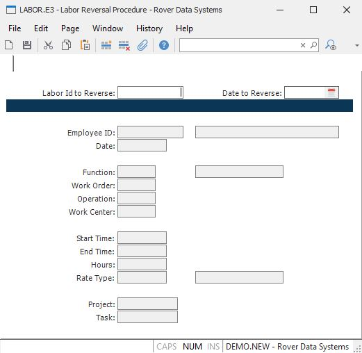

##  Labor Reversal Procedure (LABOR.E3)

<PageHeader />

##

**Labor ID** This field is not displayed. A labor id will be assigned at file-
time.  
  
**Orig Labor Id** Enter the labor id to be reversed.  
  
**Date to Reverse** Enter the date this labor record should be reversed on.
The date in the original labor record will be defaulted into this field for
you.  
  
**Employee ID** Enter the identification of the employee whose labor is to be
posted. The employee ID is checked against the entries in the employee file.  
  
**Employee Name** Contains the name of the employee identified by the employee
number entered. The name displayed is for information only and may not be
changed.  
  
**Date** The date the original labor record was created for.  
  
**Function** The function code used in this labor record.  
  
**Work Order** The work order number posted to this labor record.  
  
**Operation** The work order operation posted to this labor record.  
  
**Work Center** The work center posted to this labor record.  
  
**Start Time** The start time posted to this labor record.  
  
**End Time** The end time posted to this labor record.  
  
**Hours** The labor hours to be reversed.  
  
**Type** The rate type (regular, over-time, etc.) used in calculating the
dollars for this labor record.  
  
**Project Id** The project posted to this labor record.  
  
**Task Id** The project task ID posted to this labor record.  
  
**Function Description** Displays the description from the [ LABOR.CONTROL ](../../../../../rover/AP-OVERVIEW/AP-ENTRY/AP-E/CHECKS-E/AP-CONTROL/GLCHART-E/GLCHART-E-1/GLCHART-R2/WO-CONTROL/WO-CONTROL-1/LABOR-CONTROL) record for the labor function entered.   
  
**Rate Description** Displays the description from the [ LABOR.CONTROL ](../../../../../rover/AP-OVERVIEW/AP-ENTRY/AP-E/CHECKS-E/AP-CONTROL/GLCHART-E/GLCHART-E-1/GLCHART-R2/WO-CONTROL/WO-CONTROL-1/LABOR-CONTROL) record for the rate type entered.   
  
  
<badge text= "Version 8.10.57" vertical="middle" />

<PageFooter />