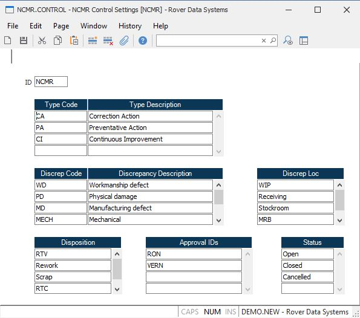

##  NCMR Control Settings (NCMR.CONTROL)

<PageHeader />

##

**Control ID** The entry NCMR will be defaulted and is the only option.  
  
**Type code** Enter the list of type codes that can be assigned during [ NCMR.E ](../../../../../rover/PRO-OVERVIEW/PRO-ENTRY/NCMR-E) .   
  
**Type Description** Enter the description of the associated type code.  
  
**Discrep Code** Enter the list of discrepancy codes that will be allowed in  
  
**Disxrepancy Desc** Enter a description for the associated discrepancy code.  
  
**Discrepancy Loc** Enter the list of discrepancy locations which can be
chosen in  
  
**Disposition** Enter the disposition list that the user can select from
during  
  
**Approval IDs** Enter the list of user login IDs which identify who will be
allowed to approve an NCMR document.  
  
**Status** Enter the status codes that will be allowed in the NCMR process.  
  
  
<badge text= "Version 8.10.57" vertical="middle" />

<PageFooter />