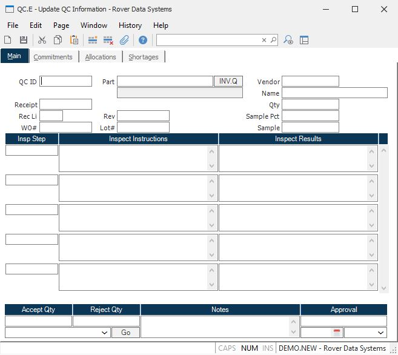

##  Update QC Information (QC.E)

<PageHeader />

##  Main

**ID** Enter the QC number you wish to view/update. Leave this field empty to
assign the next sequential number.  
  
**PO** Enter the PO receipt number, if applicable.  
  
**Rec Line** This field contains the line item on the receipt.  
  
**WO** Enter the WO number, if applicable.  
  
**Part** Enter the part number.  
  
**Part desc** This field contains the part description, as found in [ PARTS.E ](../../../../ENG-OVERVIEW/ENG-ENTRY/PARTS-E/README.md) . It is displayed for reference only.   
  
**Rev** Enter the part rev.  
  
**Lot** Enter the lot number.  
  
**Vendor** This field contans the vendor name. It is originally defaulted from
the PO (if present) and may be changed.  
  
**Vendor Name** This field contains the vendor name, as originally defaulted
from the vendor number entry. It may be entered or changed, as required.  
  
**Qty** Enter the total quantity being processed.  
  
**Sample Pct** This field contans the sampling percentage. It is originally defaulted from [ PARTS.E ](../../../../ENG-OVERVIEW/ENG-ENTRY/PARTS-E/README.md) and may be changed as needed.   
  
**Sample** This field contains the sample quantity to be tested. It is
calculated as the total quantity factored by the sample percentage.  
  
**Insp Step** This field contans the inspection step. It may be defaulted from the [ PARTS.E ](../../../../ENG-OVERVIEW/ENG-ENTRY/PARTS-E/README.md) data and changed as needed.   
  
**Insp Instruct** This field contans the inspection instructions. It may be defaulted from the [ PARTS.E ](../../../../ENG-OVERVIEW/ENG-ENTRY/PARTS-E/README.md) data and changed as needed.   
  
**Insp Results** Enter the inspeciton results.  
  
**Accept Qty** Enter the quantity being accepted after inspection.  
  
**Reject Qty** Enter the quantity being rejected after inspection.  
  
**Notes** Enter any notes pertaining to this QC record.  
  
**Approval** This field contains the name or ID of the person approving this
QC record.  
  
**Go** Click on this button to invoke the procedure defined in the drop down
box. This feature allows the user to perform functions such as making
inventory movements; shop movements; work order completions; etc.  
  
**Function** Select the function you wish to perform. These functions include:
moving accepted material; scrapping material; making ship movements; etc.  
  
**INV.Q** Click on this button to invoke the [ INV.Q ](../../../../INV-OVERVIEW/INV-REPORT/INV-Q/README.md) screen.   
  
**App Date** This field contains the approval date. It defaults to the date on
which the approval field above is entered and can be changed as required.  
  
**App Time** This field contains the approval time. It defaults to the time on
which the approval field above is entered and can be changed as required.  
  
  
<badge text= "Version 8.10.57" vertical="middle" />

<PageFooter />