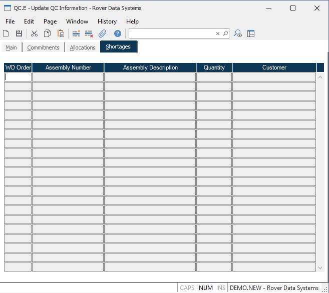

##  Update QC Information (QC.E)

<PageHeader />

##  Shortages

**WO#** Contains the work order number which has a shortage of the part
displayed.  
  
**Assembly Number** Contains the number of the top assembly on the associated
work order.  
  
**Assembly Description** Contains the description of the assembly for the
associated work order.  
  
**Quantity** Contains the quantity of the part which is short on the
associated work order.  
  
**Customer Name** The customer name on the work order which has a shortage of
the part displayed.  
  
  
<badge text= "Version 8.10.57" vertical="middle" />

<PageFooter />