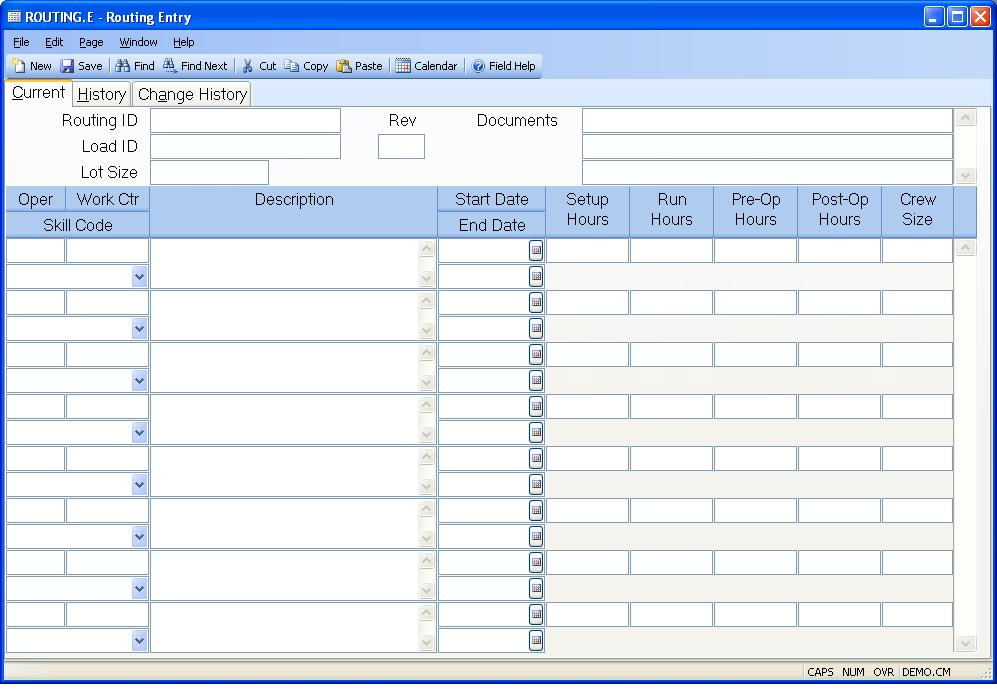

##  Routing Entry (ROUTING.E)

<PageHeader />

##  Current

**Routing ID** Enter the ID of the routing you want to add or update. Routings
may defined with any form of record ID desired, however those which are
assigned the same number as an existing part number will automatically be used
as the default routing when work orders are created for the part. If you enter
a new ID which does not identify an existing part , you will receive a warning
message stating this fact. It does not prevent you from using the ID entered.  
  
**Load Routing** You may load an existing routing as the starting point for
the current routing by entering the ID of the routing to be loaded in this
field. This option is only permitted on new records.  
  
**Lot Size** Enter the standard lot size used for this routing. The lot size
is used as a means of scaling the run hours so that they reflect the number of
hours required to complete the number of units specified by lot size. For
example, if you have set the lot size to 100 and enter the run hours for a
given operation to 3.50, you are saying that it takes 3.5 hours to complete
100 units at the operation, or .035 hours per unit (3.5 / 100). If no lot size
is specified then 1 is assumed.  
  
**Rev** Enter the current revision for the routing. If a change was made to
the revision then the new revision will be added to the history list when the
routing is saved or when you click on the history tab. You may add an
effectivity date and description on the history tab if desired.  
  
**Documents** Enter all of the documents that are associated with the current
revision of the routing. These will appear on the work order traveler.  
  
**Operation** Enter the operation number associated with the routing
information defined.  
  
**Work Center** Enter the work center at which the operation is performed.  
  
**Skill Code** Select the skill code that applies to this operation. Skill codes are defined in the [ SKILL.CONTROL ](SKILL-CONTROL.htm) procedure and defines the skills an employee must have to perform the operation.   
  
**Description** Enter a description and/or instructions which are associated
with the operation.  
  
**Start Eff Date** Enter the date on which the associated item is to become
active. If no date is entered the item is assumed to be active.  
  
**End Eff Date** Enter the last date on which the associated item is still
active. After this date the item will no longer be active. A null entry
indicates that the item has no expiration date.  
  
**Setup Hours** Enter the hours required for setup before work can begin at
the operation.  
  
**Run Hours** Enter the number of hours required at the operation to complete
the number of units indicated in the lot size.  
  
**Pre-Operation Hours** Enter the number of hours for which materials are
queued at the work center before work is started. This entry is defaulted from
the Work Center file.  
  
**Post-Operation Hours** Enter the number of hours that the materials wait
and/or take to moved from the operation after completion.  
  
**Crew Size** Enter the number of workers or machines normally used at the
same time for this job.  
  
  
<badge text= "Version 8.10.57" vertical="middle" />

<PageFooter />