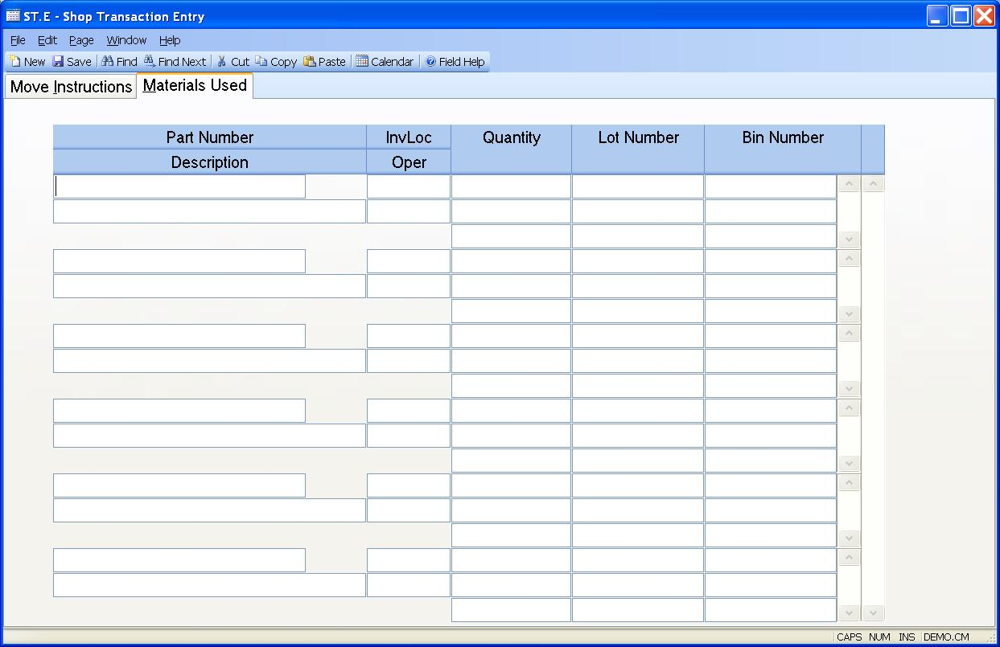

##  Shop Transaction Entry (ST.E)

<PageHeader />

##  Materials Used

**Pull Part** If the work order being moved is setup to use backflushing of
materials, and there are items specified on the BOM to be pulled at the from
operation, they will be listed here. You may make adjustments as required.  
  
**Description** Displays the description of the associated part number. It may
not be changed.  
  
**Pull Invloc** Enter the inventory location from which the associated part
number was pulled.  
  
**Pull Oper** Displays the operation associated with the part number being
backflushed.  
  
**Part Quantity** Enter the quantity of the associated part number consumed in
order to process the assemblies  
moved through the operation.  
  
**Lot Number** If the associated part number is lot controlled, enter the lot
number that was used.  
  
**Bin Number** If the location from which the associated part number was
pulled in bin controlled, enter  
the bin number from which the parts was pulled.  
  
  
<badge text= "Version 8.10.57" vertical="middle" />

<PageFooter />