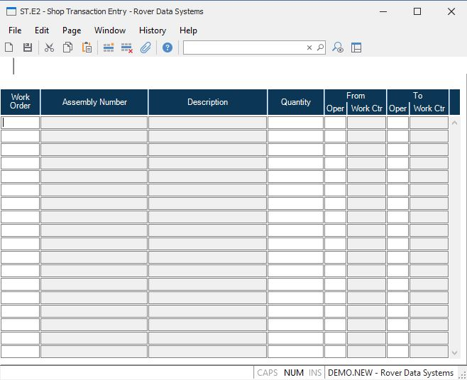

##  Shop Transaction Entry (ST.E2)

<PageHeader />

##

**Shop Transaction ID** The shop transaction ID does not appear on the screen
and is assigned to each item entered when it is processed after filing.  
  
**Work Order** Enter the number of the work order against which the
transaction took place.  
  
**Assembly Number** This field displays the part or assembly number the work
order was created for. This data is displayed for reference only and cannot be
changed.  
  
**Description** Contains the description of the assembly for the work order
entered. This data is displayed for information only and may not be changed.  
  
**Quantity** Enter the quantity of items moved.  
  
**From Oper** Enter the operation from which the items were moved. The
operation number must match one of the operations listed in the routing for
the work order.  
  
**From Work Center** The from work center ID is loaded in this field when a
from operation is entered. The work center ID is retrieved from the routing
for the work order based on the operation number.  
  
**To Oper** Enter the operation to which the items were moved. The operation
number must match one of the operations listed in the routing for the work
order.  
  
**To Work Center** The to work center ID is loaded in this field when a to
operation is entered. The work center ID is retrieved from the routing for the
work order based on the operation number.  
  
  
<badge text= "Version 8.10.57" vertical="middle" />

<PageFooter />