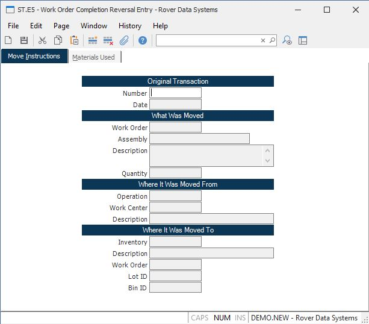

##  Work Order Completion Reversal Entry (ST.E5)

<PageHeader />

##  Move Instructions

**Shop Transaction ID** The shop transaction ID does not appear on the screen
and is assigned to each item entered when it is processed after filing.  
  
**Original Trans#** Enter the number of the completion transaction you want to
reverse.  
  
**Transaction Date** Contains the date on which the original transaction was
posted. The current date will be posted to the reversal transaction.  
  
**Work Order** Contains the number of the work order against which the
original transaction took place.  
  
**Assembly** This field contains the assembly number from the work order
entered. It is for display only and may not be changed.  
  
**Description** Contains the description of the assembly for the work order.  
  
**Quantity** Contains the quantity of items completed or scrapped on the
original transaction.  
  
**From Oper** Contains the operation from which the items were moved on the
original transaction.  
  
**From Work Center** Contains the work center number associated with the
operation.  
  
**From Description** Contains the description of the from operation for the
work order entered.  
  
**To Inventory** Contains the inventory location the items were moved into on
the original completion transaction.  
  
**To Description** Contains the description of the inventory location to which
the items were moved.  
  
**To Work Order** Contains the work order into which the items were moved on
the original transaction.  
  
**Lot ID** Contains the lot number associated with the original transaction.  
  
**Bin ID** This field contains the bin number into which the original
completion was done, and from which the material is to be removed.  
  
  
<badge text= "Version 8.10.57" vertical="middle" />

<PageFooter />