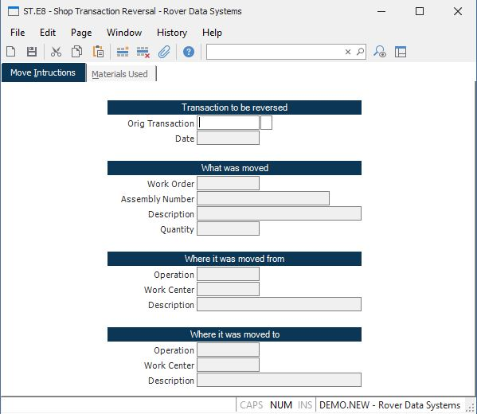

##  Shop Transaction Reversal (ST.E8)

<PageHeader />

##  Move Intructions

**Shop Transaction ID** The shop transaction ID does not appear on the screen
and is assigned to each item entered when it is processed after filing.  
  
**Orig Trans** Enter the number of the original transaction you want to
reverse.  
  
**Trans Date** Displays the date on which the original transaction was posted.  
  
**Work Order** Work order number affected by the transaction.  
  
**Assembly Number** This field contains the assembly number for the work
order. It is displayed for reference only and cannot be changed.  
  
**Description** Contains the description of the assembly for the work order
entered. This data is displayed for information only and may not be changed.  
  
**Quantity** The quantity of items moved.  
  
**From Oper** The operation from which the items were moved.  
  
**From Work Center** The from work center ID is loaded in this field when a
from operation is entered. The work center ID is retrieved from the routing
for the work order based on the operation number.  
  
**From Description** Contains the description of the from operation for the
work order entered. This data is displayed for information only and may not be
changed.  
  
**To Oper** The operation to which the items were moved. The operation number
must match one of the operations listed in the routing for the work order.  
  
**To Work Center** The to work center ID is loaded in this field when a to
operation is entered. The work center ID is retrieved from the routing for the
work order based on the operation number.  
  
**To Description** Contains the description of the to operation for the work
order entered. This data is displayed for information only and may not be
changed.  
  
  
<badge text= "Version 8.10.57" vertical="middle" />

<PageFooter />