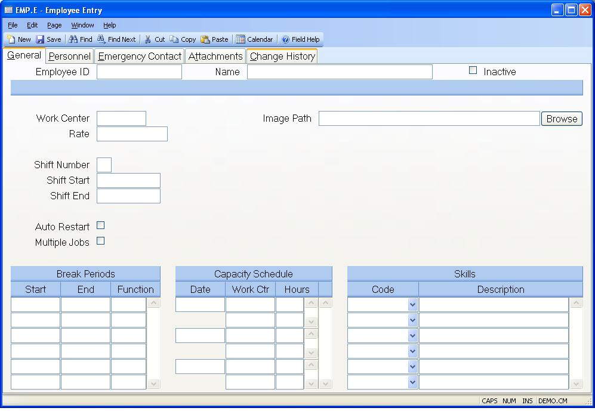

##  Employee Entry (EMP.E)

<PageHeader />

##  General

**Employee ID** Enter the number which identifies the employee to be accessed.
If you are defining a new employee you may choose to leave this field blank
and allow the system to assign the next available sequential number as the ID.
The employee ID field is also large enough to accommodate the use of a social
security number.  
  
**Employee Name** Enter the name of the employee defined by the record.  
  
**Inactive** Check this field if the employee number is no longer considered
active. This will prevent the employee number from being used on any new
transaction. Transactions that already reference the employee number are not
affected.  
  
**Work Center** Enter the work center at which the employee normally performs
his job. This is used as the default work center for labor entry.  
  
**Rate** Enter the rate at which the employees hours are to be charged when
labor entries are made. The rate should represent the normal hourly wage paid.  
  
**Shift Number** Enter the number of the shift that the employee normally works. This field is used by the time keeping procedures to determine the shift start and end times from the work center record, or the [ LABOR.CONTROL ](../../../../../../../../../../../../../../../../rover/AP-OVERVIEW/AP-ENTRY/AP-E/CHECKS-E/AP-CONTROL/GLCHART-E/GLCHART-E-1/GLCHART-R2/WO-CONTROL/WO-CONTROL-1/LABOR-CONTROL) procedure. If you enter start and end times that are specific to this employee, then this field is ignored.   
  
**Shift Start** The time keeping system checks employee clock-ins against predefined entries in EMP.E, [ WC.E ](../../../../../../../../../../../../../../../../rover/AP-OVERVIEW/AP-ENTRY/AP-E/CHECKS-E/AP-CONTROL/GLCHART-E/GLCHART-E-1/GLCHART-R2/COST-CONTROL/WC-E) , and the [ LABOR.CONTROL ](../../../../../../../../../../../../../../../../rover/AP-OVERVIEW/AP-ENTRY/AP-E/CHECKS-E/AP-CONTROL/GLCHART-E/GLCHART-E-1/GLCHART-R2/WO-CONTROL/WO-CONTROL-1/LABOR-CONTROL) procedure. If no entry is found in this field, the entry in the associated work center record is used, and if that is blank the entry in [ LABOR.CONTROL ](../../../../../../../../../../../../../../../../rover/AP-OVERVIEW/AP-ENTRY/AP-E/CHECKS-E/AP-CONTROL/GLCHART-E/GLCHART-E-1/GLCHART-R2/WO-CONTROL/WO-CONTROL-1/LABOR-CONTROL) is used. This allows you to define special shift start times for an employee if his start time is different from the standard work center time, or default entries in [ LABOR.CONTROL ](../../../../../../../../../../../../../../../../rover/AP-OVERVIEW/AP-ENTRY/AP-E/CHECKS-E/AP-CONTROL/GLCHART-E/GLCHART-E-1/GLCHART-R2/WO-CONTROL/WO-CONTROL-1/LABOR-CONTROL) .   
  
**Shift End** The time keeping system checks employee clock-outs against predefined entries in EMP.E, [ WC.E ](../../../../../../../../../../../../../../../../rover/AP-OVERVIEW/AP-ENTRY/AP-E/CHECKS-E/AP-CONTROL/GLCHART-E/GLCHART-E-1/GLCHART-R2/COST-CONTROL/WC-E) , and the [ LABOR.CONTROL ](../../../../../../../../../../../../../../../../rover/AP-OVERVIEW/AP-ENTRY/AP-E/CHECKS-E/AP-CONTROL/GLCHART-E/GLCHART-E-1/GLCHART-R2/WO-CONTROL/WO-CONTROL-1/LABOR-CONTROL) procedure. If no entry is found in this field, the entry in the associated work center record is used, and if that is blank the entry in [ LABOR.CONTROL ](../../../../../../../../../../../../../../../../rover/AP-OVERVIEW/AP-ENTRY/AP-E/CHECKS-E/AP-CONTROL/GLCHART-E/GLCHART-E-1/GLCHART-R2/WO-CONTROL/WO-CONTROL-1/LABOR-CONTROL) is used. This allows you to define special shift end times for an employee if his end time is different from the standard work center time, or default entries in [ LABOR.CONTROL ](../../../../../../../../../../../../../../../../rover/AP-OVERVIEW/AP-ENTRY/AP-E/CHECKS-E/AP-CONTROL/GLCHART-E/GLCHART-E-1/GLCHART-R2/WO-CONTROL/WO-CONTROL-1/LABOR-CONTROL) .   
  
**Auto Restart** Check this box if you want the system to automatically log
the employee back into the job or function he was assigned to the last time he
clocked out. If this field is blank then the auto restart field in the work
center defined for the employee will be used.  
  
**Multiple Jobs** Check this box if the employee is permitted to be logged
into more than one job at the same time. This would be done in cases where one
employee is operating several machines at the same time with different jobs on
each one. The time keeping procedures will divide the hours between the jobs.
If this field is not set to "Y" then the system will not allow more than one
job to be run at a time.  
  
**Image Path** Enter the network path at which the picture of the employee can
be found. This path must be accessible from the viewpoint of the client PC,
not the server.  
  
**Browse** Click this button to browse the local network for the file you want
to add to this employee record.  
  
**Break Start** Enter the time at which each break period begins. The time
must be entered in 24 hour format so that 8:00 A.M. is entered as 8:00, and
8:00 P.M. is entered as 20:00.  
  
**Break End** Enter the time at which each break period ends. The time must be
entered in 24 hour format so that 8:00 A.M. is entered as 8:00, and 8:00 P.M.
is entered as 20:00.  
  
**Break Function** Break periods are handled in one of two ways depending on
whether or not a break function is entered in this field. If a break function
is not present then the period of time specified by the start and end times is
simply reduced from the elapsed hours when labor is entered. For example, if
the start time for the labor entry is entered as 8:00 and the end time is
entered as 11:00 then the labor entry would normally calculate that 3 hours
had been worked. However, if a break period was defined beginning at 10:00 and
ending at 10:15 the hours would be calculated as 2.75. If a function type is
present for the associated break period then the entry is still reduced by .25
hours, but the .25 hours is posted as overhead against the account number
associated with the function so that 3 hours are posted. An example of this
would be the lunch period which is not posted to overhead because it is not a
paid break period, while a 15 minute coffee break is paid and therefore needs
to be charged to overhead.  
  
**Capacity Date** If you have setup the capacity system to load available work
center hours based on employee loading then you must indicate at least one
date, work center and available hours as the basis for the amount of time to
plan for the employee. The date you enter in this field indicates what day the
associated hours are available. In the absence of subsequent dates this
information will continue to be used. For example, if the employee was
assigned to the drill work center with 7 hours available per day you would
enter the current date, or an earlier date in this field, DRILL in the work
center field, and 7 in the hours field. You may also split the hours by
entering multiple work centers with hours associated to each. If you needed to
temporarily move the employee to another work center at a future date you
would add the new date and indicate the work centers and hours, and then add
another date with work centers and hours to set them back to their original
assignment. You can remove any dates that are no longe  
r applicable.  
  
**Capacity Work Center** Enter one or more work centers that the employee will
be assigned to beginning on the associated date.  
  
**Capacity Hours** Enter the hours that the employee is assigned to the
associated work center.  
  
**Skill Code** Select each of the skill codes that apply to the employee. Skill codes are defined in the [ SKILL.CONTROL ](SKILL-CONTROL.htm) procedure and indicate the skills the employee is capable of performing.   
  
**Skill Description** Displays a short description of the associated skill
code.  
  
**Employee Image** Picture of employee displayed.  
  
  
<badge text= "Version 8.10.57" vertical="middle" />

<PageFooter />