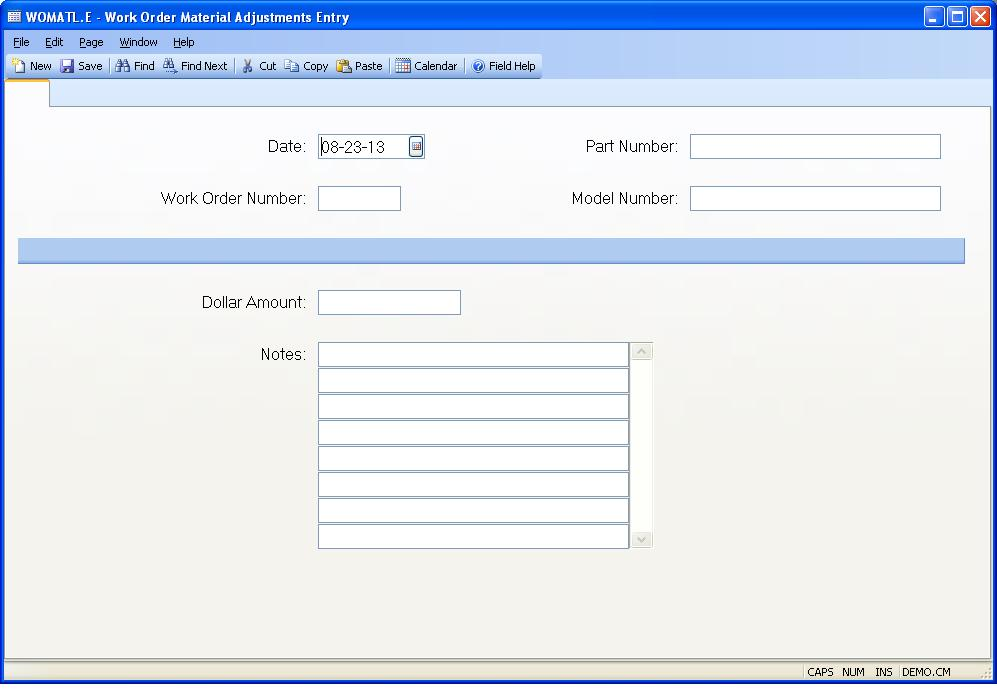

##  Work Order Material Adjustments Entry (WOMATL.E)

<PageHeader />

##

**Womatl.Id** The record ID is assigned by the system when the transaction is
filed. It is not prompted on the screen.  
  
**Date** Enter the date on which the transaction is to be posted. This date
will be used on the accounting registers which feed the general ledger. The
system will default the current date.  
  
**Work Order Number** Enter the work order number that is to be affected by
the transaction. Transactions may not be made against finalized work orders.  
  
**Dollar Amount** Enter the dollar amount to be applied to the material
dollars of the work order. You may enter both positive and negative values.  
  
**Notes** Enter any notes which may be helpful in explaining the reason for
making this transaction.  
  
**Part Number** Contains the part number of the assembly called out on the
work order. The data in this field may not be altered.  
  
**Model Number** Contains the model number assigned to the assembly on the
work order. This information may not be changed.  
  
  
<badge text= "Version 8.10.57" vertical="middle" />

<PageFooter />