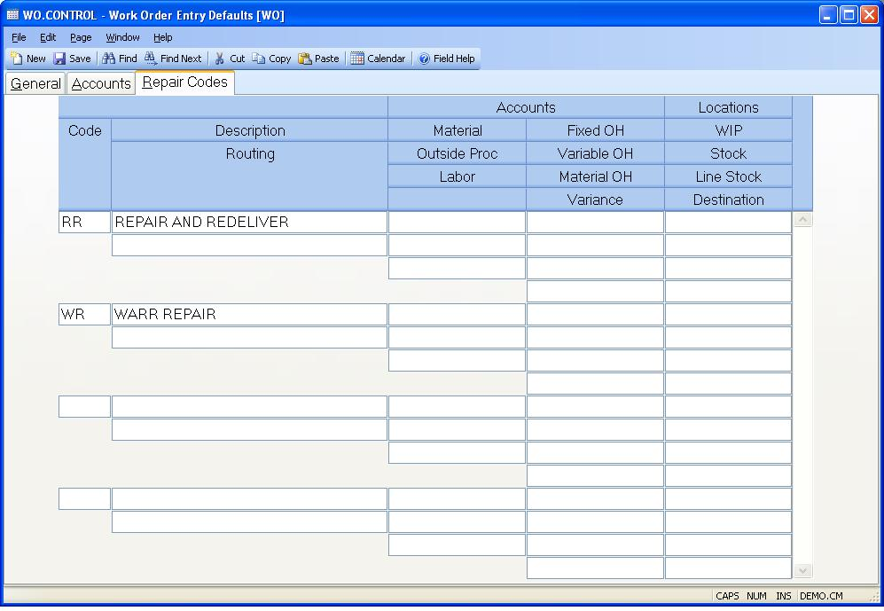

##  Work Order Entry Defaults (WO.CONTROL)

<PageHeader />

##  Repair Codes

**Repair Code** Enter all of the valid repair codes and their associated
expense accounts. If a work order is created and one of these repair codes are
entered, all of the costs applied to the work order will be expensed to the
associated accounts when the work order is finalized.  
  
**Repair Code Description** Enter a description of the associated code.  
  
**Repair Routing** Enter the routing to be used when this repair code is used.
If no entry is made the standard routing for the assembly will be defaulted.  
  
**Repair Material Account** Enter the account number to use in expensing the
costs of material consumed in work orders containing the associated repair
code.  
  
**Repair Outside Processing Account** Enter the account number to use in
expensing the costs of outside processing consumed in work orders containing
the associated repair code.  
  
**Repair Labor Account** Enter the account number to use in expensing the
costs of labor consumed in work orders containing the associated repair code.  
  
**Repair Fixed Overhead Account** Enter the account number to use in expensing
the costs of fixed overhead consumed in work orders containing the associated
repair code.  
  
**Repair Variable Overhead Account** Enter the account number to use in
expensing the costs of variable overhead consumed in work orders containing
the associated repair code.  
  
**Repair Material Overhead Account** Enter the account number to use in
expensing the costs of material overhead consumed in work orders containing
the associated repair code.  
  
**Repair Variance Account** If there is a difference between the value of the
final assembly at the time it was pulled into the work order compared to when
it was completed from the work order, the variance will be posted to this
account.  
  
**Repair WIP Location** Enter the work in process location to be assigned to
the rework work order.  
  
**Repair Stock Location** Enter the default location from which materials for
the rework work order will be pulled.  
  
**Repair Line Stock Location** Enter the location from which line stock for
the repair work order is to be pulled.  
  
**Repair Destination Location** Enter the destination location into which
items from the repair work order are completed.  
  
  
<badge text= "Version 8.10.57" vertical="middle" />

<PageFooter />