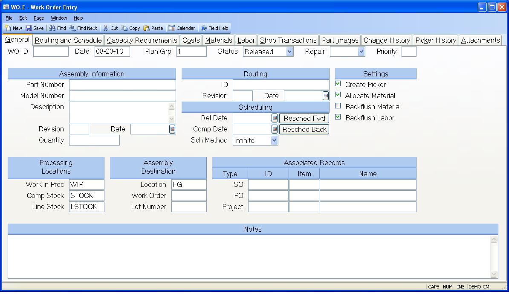

##  Work Order Entry (WO.E)

<PageHeader />

##  General

**Work order ID** Enter the ID of the work order you wish to create or access.  
  
**Work order date** Enter the date on which this work order was created.  
  
**Plan Group** Enter the planning group which is assigned to this work order.
This will be used to default the inventory and WIP locations.  
  
**Status** This field should contain one of the following status codes:  
  
New  
Enter this code if you want only to enter the work order but do not want any
further action taken at this time.  
  
Open  
Use this code if you want to create a work order specific bill of material.  
  
Released  
Set the status to this code when you are ready to create the picking list
record.  
  
Pulled  
Set by the system after the material is pulled. May also be set manually for
cases where no picker is to be created.  
  
Started  
Set by the system when the first shop transaction is entered.  
  
Closed  
Set by the system when the total work order quantity has been completed, or
may be set manually to close the work order short.  
  
Finalized  
Set by the system when the work order is finalized. No further transactions
are permitted.  
  
**Repair Type** If the work order is being created for the purpose of
repairing an existing assembly select the repair type to be used. Otherwise
leave this field blank.  
  
**Priority** Enter the priority code being assigned to this work order. This
field controls the order in which the work orders appear on the dispatch list.  
  
**Part number** Enter the part number of the assembly to be built by this work
order. Leave this field empty to create a work order without a part number.  
  
**Model Number** If there is a model number specified on the PARTS record for
the part number entered, it will be loaded in this field. The user may change
this field as desired. Care should be taken when a change is made since the
data in this field is used as a cross reference to the work order.  
  
**Description** The description is loaded from the PARTS record for the part
number entered. The description may be changed if desired.  
  
**Revision** Enter the revision level of the assembly to be built.  
  
**Bom Eff Date** The effectivity date determines which items from the bill of
material and routing will be used for the work order. The effectivity date is
defaulted based on the revision entered and may be changed if required. If no
date is specified the release date of the order is used.  
  
**Quantity** Enter the quantity to be built on this work order. If there are
any completions against the work order then you are restricted from reducing
the quantity below the amount already completed. If you increase the quantity
the added quantity will be loaded into the first step of the routing. If you
reduce the quantity the amount of the reduction will be subtracted from
successive steps in the routing beginning with the first step until the amount
of the change is consumed.  
  
**Routing** Enter the identification of the routing to be used with the work order. The system will attempt to load a routing with an ID that is the same as the part number previously entered. If it does not find a routing on file it will load the default routing defined by the [ WO.CONTROL ](../../WO-CONTROL/README.md) procedure.   
  
**Route Rev** Enter the revision of the routing to be used.  
  
**Route Eff Date** Enter the routing effectivity date to be used.  
  
**Rel Date** Enter the date on which this work order is to be released for
kitting. The system will calculate this date if you leave this field blank,
enter a completion date, and select either Finite or Infinite for the schedule
method. You may also click on on of the reschedule buttons to recalculate
either of the dates.  
  
**Req Date** Enter the date on which this work order is to be completed. The
system will calculate this date if you leave this field blank, enter a release
date, and select either Finite or Infinite as the schedule method. You may
also click on on of the reschedule buttons to recalculate either of the dates.  
  
**Schedule Method** Select one of the following which defines how the system
should schedule the operations in the work order.  
  
Finite  
The system will calculate the start and end dates of each operation based on
available capacity at each work center.  
  
Infinite  
The system will calculate the start and end dates for each operation based on
the hours specified in the routing. Capacity at each operation is assumed to
be infinite.  
  
Manual  
The system does not calculate the operation start and end dates. The user must
enter them manually. The system will forward or backward schedule based on
whether the release date or completion date is left blank. If the release date
is entered and the completion date is left blank then the system will
calculate the completion date by forward scheduling from the release date. If
the release date is blank and the completion date is entered then the release
date is calculated by backward scheduling from the completion date. If both
dates are entered then manual scheduling is assumed and no calculations are
performed.  
  
**Reched Fwd** Click this button to recalculate the routing schedule based on
the routing information. The schedule method must be set to Finite or Infinite
and there must be a date specified in the Release Date field.  
  
Note: The system will automatically recalculate the schedule anytime the the
Schedule Method is changed.  
  
**Resched Back** Click this button to recalculate the routing schedule based
on the routing information. The schedule method must be set to Finite or
Infinite and there must be a date specified in the Complete Date field.  
  
Note: The system will automatically recalculate the schedule anytime the the
Schedule Method is changed.  
  
**Create Picker** Check this box if a picker record is to be created to pull
material for this work order.  
  
**Allocate** Check this box to allocate components. If you will not be
backflushing materials, the componet material will be allocated while the work
order is in a status of "R" (released). If you will be backflushing material,
the allocation for the component material will be based on the open balance of
the work order.  
  
**Backflush Material** Check this box if you want component materials to be backflushed as the assembly is moved through the manufacturing process. This field is originally defaulted from the [ WO.CONTROL ](../../WO-CONTROL/README.md) data. Note: For backflushing to occur you check the "Create Picker" prompt. For backflush work orders, if any component is coded with a "P" operation in the bill of material, then the work order status will be set to "R" when the picklist is created, and the picker step must be performed to pull those parts coded as "P" before the first operation is started. The parts not coded as "P" will be backflushed.   
  
**Backflush Labor** If you wish to backflush labor at standard, check this box. This field is originally defaulted from the [ WO.CONTROL ](../../WO-CONTROL/README.md) data.   
  
**Work in process location** Enter the work in process location where this
work order will be assembled.  
  
**Stock location** Enter the inventory location from which materials will be
pulled.  
  
**Line stock location** Enter the location from which line stock items are to
be pulled.  
  
**Destination Location** Enter the inventory location into which the items on
this work order are to be completed.  
  
**Destination WO#** If a work in process location was specified as the
destination location then the number of the work order the items are detined
for must be entered.  
  
**Destination Lot#** If the item being created by the work order is lot
controlled, you have the option of specifying the default lot number to be
assigned to the completed items. If a lot number is not specified then this
field will be loaded with the lot number assigned by the first completion from
the work order, and used as the default for subsequent completions.  
  
**Sales order number** If this work order is to satisfy the requirements of a
specific sales order, then enter the sales order number here.  
  
**Sales order line number** Enter the line item on the sales order which has
the requirement for the assembly being built by this work order.  
  
**Customer name** Enter the name of the customer who ordered these parts if
applicable.  
  
**PO ID** If this work order is to satisfy the requirements of a specific
purchase order, then enter the purchase order number here.  
  
**PO LI** Enter the line item on the purchase order which has the requirement
for the assembly being built by this work order.  
  
**Vendor Name** Contains the vendor name from the purchase order.  
  
**Project Id** If this work order is for a project, enter the project number.
This will cause the costs associated with this WO to be added into the project
costs.  
  
**Task Id** Enter the task ID associated with the project for this work order.
A lookup is provided to show all the tasks for the project.  
  
**Project Title** Displays the title of the project that is associated with
the work order.  
  
**Notes** Enter any notes applicable to this work order.  
  
  
<badge text= "Version 8.10.57" vertical="middle" />

<PageFooter />