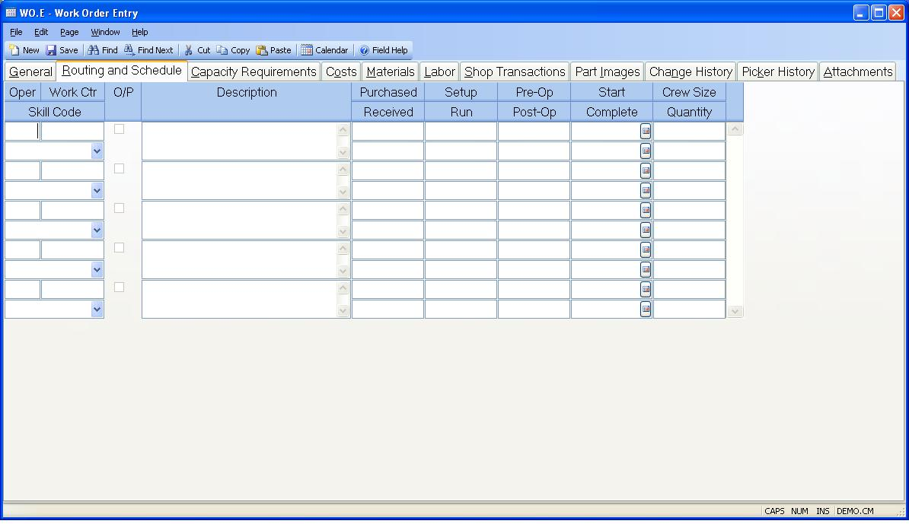

##  Work Order Entry (WO.E)

<PageHeader />

##  Routing and Schedule

**Operation Number** Contains the operation number loaded from the routing
file. Operation numbers may be added, changed, or removed as required.  
  
**Work Center** Contains the work center loaded from the routing file for the
operation. Work centers may be changed as required. If a new operation has
been added then the setup, preoperation and postoperation hours will be loaded
from the Work Center file.  
  
**Skill Code** Select the skill code that is required of the person performing the associated operation. Skill codes are defined in the [ SKILL.CONTROL ](SKILL-CONTROL.htm) procedure.   
  
**Outside Processing** This box will be checked when the operation is for an
outside processing step.  
  
**Operation Desc** Contains the operation description from the Routing file.
This multi-line description is used to define the operation and to provide
instructive information. It may be changed as needed.  
  
**Quantity Purchased** The qty purchased for this operation will be displayed
here provided the purchase order has been set-up correctly.  
  
**Setup Hours** Contains the setup hours loaded from the Routing file. These
hours define the time it takes to setup prior to running the job at the
operation. These hours may be changed as required.  
  
**Run Hours** The run hours are loaded from the Routing file and specify the
total number of hours required to process all of the items through the
operation. The hours from the routing are multiplied by the number of items on
the work order to obtain this figure. The user may change this field as
needed.  
  
**Pre-Operation Hours** The Preoperation hours or "Queue Time" defines the
amount of time items are expected to wait at the operation before processing
begins. The hours are loaded from the Routing file and may be changed as
required. If you have a situation in which items are moved continuously from
the previous operation into this one then you may set the preoperation hours
to a negative number to cause the start date of the operation to occur before
the end date of the previous operation.  
  
**Post-Operation Hours** The Post Operation hours or "Move Time" defines the
amount of time it is expected to take items to move from the current operation
to the next one. The hours are loaded from the Routing file and may be changed
as required.  
  
**Oper Start Date** The operation start date is calculated based on the
schedule method chosen and the hours entered on the routing. The start date
defines when work on the items in the work center is to start. The dates may
be changed as required.  
  
**Oper Comp Date** The operation completion date is calculated based on the
schedule method chosen and the hours entered on the routing. The completion
date defines when work on the items in the work center will be completed. The
dates may be changed as required.  
  
**Crew Size** Enter the number of workers or machines (whichever controls the
rate of production) that will be used at the same time on this job at the
associated operation. If 0 or null is entered then one is assumed.  
  
**Current Quantity** Contains the current quantity at the associated
operation. This information may not be changed in this procedure.  
  
**Quantity Received** The qty received for this operation will be displayed
here provided the purchase order has been set-up correctly.  
  
**Routing Chart** Displays a Gantt chart of the routing schedule for the work
order.  
  
  
<badge text= "Version 8.10.57" vertical="middle" />

<PageFooter />